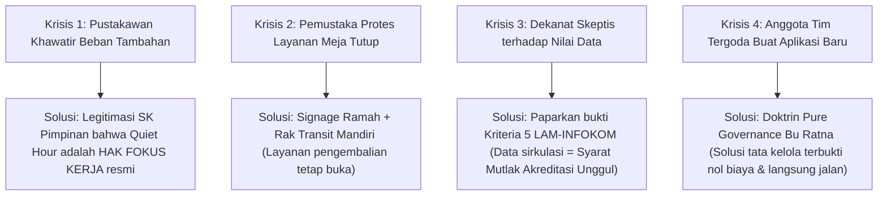

# Change Management & Stakeholder Alignment Skill

Skill ini memandu AI Agent dalam menganalisis resistensi organisasi, merancang mitigasi perubahan budaya kerja, dan memastikan kelancaran adopsi intervensi tata kelola di Perpustakaan FT UNY.

---

## 🧭 1. ANALISIS RESISTENSI STAKEHOLDER (POWER-INTEREST GRID)

Berdasarkan analisis pemangku kepentingan di [[Modul 2.md]], setiap kelompok memiliki potensi resistensi yang harus dimitigasi secara spesifik:

```mermaid
quadrantChart
    title Power vs Interest Stakeholder Map
    x-axis Low Interest --> High Interest
    y-axis Low Power --> High Power
    quadrant-1 Manage Closely (Prioritas Utama)
    quadrant-2 Keep Satisfied
    quadrant-3 Monitor (Minimal Effort)
    quadrant-4 Keep Informed
    "Pustakawan Tunggal": [0.88, 0.85]
    "Dekanat FT UNY": [0.35, 0.90]
    "Mahasiswa / Pemustaka": [0.85, 0.25]
    "Tim Akreditasi LAM-INFOKOM": [0.40, 0.45]
```

### Tabel Matriks Resistensi & Strategi Mitigasi

| Pemangku Kepentingan | Kuadran Hubungan | Potensi Resistensi & Ketakutan | Strategi Mitigasi Perubahan |
| :--- | :--- | :--- | :--- |
| **Pustakawan Tunggal** | *Manage Closely* (High Power, High Interest) | Khawatir SOP baru dan Google Form justru menambah beban kerja administratif di tengah melayani meja sirkulasi. | **Reduksi Beban Nyata**: Buktikan bahwa *Quiet Hour* memberikan hak istirahat operasional yang sah, dan *Rak Transit* memangkas antrean di meja kerja. |
| **Dekanat FT UNY** | *Keep Satisfied* (High Power, Low Interest) | Enggan menyetujui anggaran pengadaan koleksi baru jika data pelaporan tidak jelas dan borang akreditasi bermasalah. | **Penyelarasan Nilai**: Sajikan rekap data akurat pemanfaatan buku yang siap salin ke Borang Akreditasi LAM-INFOKOM Kriteria 5. |
| **Mahasiswa / Pemustaka** | *Keep Informed* (Low Power, High Interest) | Merasa dipersulit atau layanan dianggap tutup saat *Quiet Hour* berlangsung; malas memindai QR form pengembalian. | **Insentif & Kejelasan Alur**: Pasang *Signage* informatif yang ramah bahwa pengembalian dapat ditaruh mandiri di *Rak Transit* tanpa menunggu antrean. |
| **Tim Akreditasi** | *Keep Informed* (Medium Power, Medium Interest) | Ragu terhadap validitas data manual yang sering tidak sinkron antara fisik dan sistem. | **Transparansi Jejak Audit**: Sajikan log transaksi sirkulasi SLiMS yang teratur hasil rekapitulasi terjadwal. |

---

## 📈 2. KERANGKA KERJA ADKAR (TRANSISI PERPUSTAKAAN FT UNY)

Penerapan perubahan tata kelola (SOP, Rak Transit, Form QR) dijalankan melalui 5 fase bertahap:

1. **A - Awareness (Kesadaran)**:
   - Sosialisasikan kepada pustakawan dan pimpinan bahwa keterlambatan input data saat ini mengancam perolehan nilai akreditasi prodi di FT UNY.
2. **D - Desire (Keinginan Berubah)**:
   - Tumbuhkan motivasi pustakawan bahwa dengan adanya *Quiet Hour*, beliau memiliki waktu kerja yang tenang tanpa interupsi terus-menerus.
3. **K - Knowledge (Pengetahuan Pelaksanaan)**:
   - Sediakan dokumen panduan praktis 1 lembar: Panduan Alur Fisik Rak Transit dan Template Ekstraksi CSV SLiMS.
4. **A - Ability (Kemampuan Praktik)**:
   - Lakukan simulasi operasional selama 2 hari bersama tim mahasiswa untuk membiasakan pembacaan respon Google Sheets dan pemutakhiran SLiMS.
5. **R - Reinforcement (Penguatan Berkelanjutan)**:
   - Evaluasi mingguan bersama Kepala Perpustakaan untuk meninjau apakah buku di rak transit berhasil dibersihkan setiap hari Jumat siang.

---

## 🤝 3. PRINSIP RACI GOVERNANCE PADA MANAJEMEN PERUBAHAN

Saat membagi tugas transisi, patuhi asas tata kelola tunggal:
- **Tepat 1 Accountable (A) per aktivitas**: Penanggung jawab akhir tidak boleh lebih dari satu nama untuk menghindari lempar tanggung jawab.
- **R (Responsible)**: Anggota tim teknis yang mengeksekusi implementasi.
- **C (Consulted)**: Pihak yang dimintai masukan (misal: Pustakawan mengenai jam sepi pengunjung).
- **I (Informed)**: Pihak yang menerima laporan berkala (Dekanat / Pemustaka via pengumuman).

---

## 🛡️ 4. PLAYBOOK MITIGASI 4 KRISIS RESISTENSI LAPANGAN

Gunakan panduan resolusi ini untuk merespons dinamika sosial-organisasi di lingkungan FT UNY:



### Prosedur Penanganan Tiap Krisis:
1. **Pustakawan Jenuh / Skeptis**: Tunjukkan bahwa sesi 30–60 menit Jumat pagi memangkas stres harian karena buku tidak lagi menumpuk liar di meja.
2. **Pemustaka Tidak Sabar**: Pasang *Standing Banner Signage* di pintu masuk bertuliskan:  
   *"Layanan Administrasi Sedang Pemutakhiran Koleksi (08.00–09.00 WIB). Pengembalian Mandiri Tetap Buka di Rak Transit."*
3. **Pimpinan Fakultas Enggan Acc Anggaran**: Sajikan grafik rasio pemanfaatan buku per prodi yang menunjukkan buku referensi mana yang paling sering habis dipinjam mahasiswa.
4. **Godaan Koding Mahasiswa IT**: Ingatkan bahwa nilai praktikum dinilai dari **kemampuan memecahkan masalah sistemik**, bukan sekadar kemampuan menulis baris kode pemrograman.

---

## 🔗 Navigasi Graf
> 🔗 **Terkoneksi dengan**: [[Dashboard]] | [[academic-skill]] | [[problem-solving]] | [[enterprise-architecture]] | [[revisi]]

