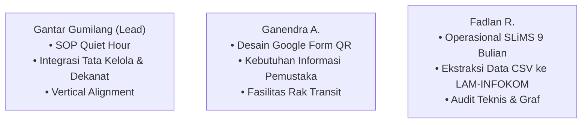

# Defense-Prep (Simulasi Tanya-Jawab & Responsi Dosen) Skill

Skill ini mempersiapkan anggota Kelompok 3 (Gantar, Ganendra, Fadlan) untuk menghadapi sesi **tanya-jawab kritis, presentasi akhir, atau responsi praktikum MSI** bersama Dosen Pengampu (Bu Ratna) dan Asisten Laboratorium.

---

## 🥊 1. BANK PERTANYAAN KRITIS BU RATNA & TANGKISAN ARGUMEN RESMI

Berikut adalah daftar pertanyaan jebakan yang sering diajukan dosen pengampu beserta kerangka jawaban terbaik berbasis tata kelola:

### Q1: "Kalian mahasiswa Teknologi Informasi, kenapa solusinya cuma SOP, Rak Transit, dan Google Form? Kenapa tidak membuat aplikasi web atau mobile baru?"
> **Tangkisan Argumen Resmi**:
> *"Izin menjawab Ibu Ratna. Berdasarkan filosofi Manajemen Sistem Informasi, intervensi sistem tidak selalu identik dengan penambahan perangkat lunak baru (Pure Governance). Dari hasil observasi dan wawancara lapangan, akar masalah di Perpustakaan FT UNY bukanlah ketiadaan aplikasi (karena perpustakaan telah memiliki SLiMS 9 Bulian yang sangat mumpuni), melainkan **ketidakmampuan pustakawan tunggal menginput data akibat interupsi fisik antrean meja sirkulasi**.*

> 
> *Jika kami membuat aplikasi baru: (1) Akan menambah beban kognitif pustakawan yang harus mempelajari sistem lain; (2) Memerlukan izin dan audit keamanan berbelit dari UPT TIK UNY; dan (3) Membutuhkan biaya pemeliharaan. Solusi SOP Quiet Hour, Rak Transit, dan formulir QR code justru memecahkan akar hambatan seketika dalam 1–2 minggu tanpa membebani anggaran fakultas sedikit pun."*

---

### Q2: "Apa hubungannya SOP Quiet Hour di tingkat operasional perpustakaan dengan Dekanat FT UNY di tingkat strategis?"
> **Tangkisan Argumen Resmi**:
> *"Hubungannya terletak pada **Penyelarasan Vertikal 3 Tingkatan Organisasi (Vertical Alignment)**:*
> 1. *Di tingkat **Operasional**, SOP Quiet Hour melindungi waktu pustakawan untuk memperbarui data pengembalian di SLiMS secara berkala tanpa terganggu antrean.*
> 2. *Di tingkat **Manajerial**, data sirkulasi yang mutakhir dan akurat memungkinkan ekstraksi data rasio pemanfaatan buku untuk pengisian Borang Akreditasi LAM-INFOKOM Kriteria 5.*
> 3. *Di tingkat **Strategis**, Dekanat FT UNY membutuhkan kepastian nilai akreditasi 'Unggul' dan data kebutuhan koleksi riil untuk mengesahkan Rencana Anggaran Biaya (RAB) pengadaan buku tahunan. Tanpa SOP operasional di bawah, data strategis pimpinan di atas akan mengalami distorsi."*

---

### Q3: "Bagaimana jika mahasiswa tetap malas memindai QR code dan pustakawan lupa menjalankan Quiet Hour?"
> **Tangkisan Argumen Resmi**:
> *"Kami memitigasinya melalui dua pendekatan:*
> 1. *Untuk **Pemustaka**: Google Form didesain sangat ringkas (hanya 4 field wajib: Nama/NIM, Judul, No Barcode, Tanggal). Ditambah lagi penempatan Signage fisik tepat di atas Rak Transit. Bahkan jika pemustaka lupa scan, buku tetap tertata di Rak Transit sehingga tidak menumpuk di meja sirkulasi.*
> 2. *Untuk **Pustakawan**: Quiet Hour diletakkan pada jadwal resmi jam sepi peminjaman (Jumat pk 08.00–09.00 WIB) dengan banner penanda layanan dialihkan ke rak transit. Kepala Perpustakaan bertindak sebagai supervisor mingguan untuk memastikan komitmen ini."*

---

### Q4: "Mengapa di RACI Matrix Modul 5 kalian, tidak ada huruf 'I' (Informed) pada anggota kelompok internal?"
> **Tangkisan Argumen Resmi**:
> *"Karena kelompok kami beranggotakan 3 orang dan mengadopsi model kerja kolaboratif agile. Seluruh anggota tim internal bertindak aktif sebagai pelaksana (**Responsible**) atau penanggung jawab mutlak (**Accountable**) per deliverable. Memberikan status 'Informed' (hanya menerima laporan) kepada anggota kelompok internal justru akan menimbulkan ketidakefektifan tim. Peran 'Informed' sengaja kami alokasikan secara murni kepada pemangku kepentingan eksternal, yaitu Dekanat dan Mahasiswa."*

---

### Q5: "Di Modul 6, kenapa strategi implementasi modul kalian memilih pendekatan Phased/Iteratif daripada Big Bang?"
> **Tangkisan Argumen Resmi**:
> *"Pendekatan Big Bang memerlukan kesiapan serentak dari seluruh komponen dan memiliki risiko disrupsi operasional yang fatal bagi layanan perpustakaan yang aktif setiap hari. Dengan kapasitas hanya satu orang pustakawan, pendekatan **Phased / Iteratif** memungkinkan pengujian fasilitas fisik (Rak Transit) terlebih dahulu pada minggu ke-1, disusul pembiasaan SOP Quiet Hour pada minggu ke-2, sebelum integrasi pelaporan borang dijalankan. Ini meminimalkan resistensi dan menjamin kelangsungan layanan harian."*

---

### Q6: "Bagaimana kalian membuktikan bahwa keterlambatan input data sirkulasi berdampak langsung pada Akreditasi LAM-INFOKOM?"
> **Tangkisan Argumen Resmi**:
> *"Pada Borang Akreditasi LAM-INFOKOM Kriteria 5 (Keuangan, Sarana, dan Prasarana), salah satu butir penilaian utama adalah **Rasio Pemanfaatan Koleksi Pustaka dan Aksesibilitas Sumber Belajar**. Jika transaksi pengembalian buku tertunda diinput ke SLiMS, data log sirkulasi tahunan akan mengalami under-reporting (tampak seolah pemanfaatan buku rendah). Selain itu, status buku di OPAC yang tidak akurat menyebabkan mahasiswa gagal mengakses referensi, menurunkan skor kepuasan pemustaka pada audit mutu internal."*

---

### Q7: "Apa jaminan kalian bahwa solusi ini tidak melanggar yurisdiksi dan regulasi UPT TIK UNY?"
> **Tangkisan Argumen Resmi**:
> *"Solusi kami berpegang teguh pada prinsip **Zero-Touch Infrastructure**. Kami tidak menempatkan skrip di server pusat, tidak memodifikasi database MySQL SLiMS universitas, dan tidak meminta pembukaan port jaringan baru. Seluruh intervensi bekerja di lapisan tata kelola fakultas: perabot fisik lokal (Rak Transit), layanan cloud publik gratis mandiri (Google Form), dan ekspor data standar via antarmuka resmi SLiMS yang sudah berizin."*

---

### Q8: "Pada Modul 7, apa yang menjadi Jalur Kritis (Critical Path) dalam penjadwalan WBS kalian?"
> **Tangkisan Argumen Resmi**:
> *"Jalur kritis proyek kami berada pada rangkaian: **Penyusunan & Pengesahan SOP Quiet Hour -> Uji Coba Rak Transit & Formulir QR -> Rekonsiliasi Data Pertama di SLiMS**. Jalur ini tidak memiliki toleransi keterlambatan (slack time = 0) karena efektivitas ekstraksi data borang akreditasi sepenuhnya bergantung pada terlaksananya pemutakhiran sirkulasi secara disiplin sejak tahap uji coba awal."*

---

### Q9: "Kenapa hanya pakai QR Code akrilik dan Google Form? Kenapa kalian tidak koding aplikasi web portal atau sistem scanner baru saja?"
> **Tangkisan Argumen Resmi (Rasionalisasi Pure Governance)**:
> *"Berdasarkan doktrin Bu Ratna di kelas, masalah perpustakaan FT UNY adalah **masalah tata kelola beban kerja pustakawan tunggal**, bukan ketiadaan aplikasi. SLiMS 9 Bulian sudah menjadi sistem otomasi katalog resmi perpustakaan universitas. Jika kami membuat aplikasi web/database baru:*
> 1. *Akan terjadi **duplikasi database** yang memicu inkonsistensi data.*
> 2. *Menambah beban pemeliharaan (server, hosting, bug maintenance) yang mustahil ditangani 1 orang pustakawan non-IT.*
> 3. *QR Code akrilik di meja baca dan Rak Transit (`RACK-001`) bersifat **Zero-Cost & Zero-Friction** bagi 52 pemustaka per hari, langsung masuk ke Spreadsheet log tanpa instalasi aplikasi, sementara SLiMS tetap menjadi **Single Source of Truth**.*

---

## 👥 2. SPESIALISASI PERAN & JAWABAN ANGGOTA TIM

Saat presentasi kelompok, pastikan pembagian suara sesuai bidang keahlian:

---

## 🎯 3. MODE INTERAKTIF SIMULASI (CARA MENGAKTIFKAN)

Jika pengguna ingin berlatih sebelum presentasi, pengguna cukup memanggil:
`"Uji aku dengan pertanyaan dosen"` atau `"/defense"`.

Agent akan berperan sebagai **Dosen Penguji yang Kritis (Devil's Advocate)** dan menanyakan satu per satu pertanyaan jebakan untuk melatih argumen pengguna hingga sempurna.

---

## 🔗 Navigasi Graf
> 🔗 **Terkoneksi dengan**: [[Dashboard]] | [[academic-skill]] | [[problem-solving]] | [[change-management]] | [[self-audit]]
