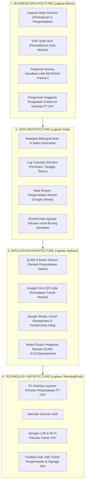

# Enterprise Architecture (4-Layer Modeling) Skill

Skill ini memandu AI Agent dalam memodelkan arsitektur tata kelola sistem informasi Perpustakaan FT UNY secara holistik menggunakan **Kerangka 4-Layer Enterprise Architecture (Bisnis, Data, Aplikasi, dan Teknologi)**.

---

## 🏛️ 1. STRUKTUR ARSITEKTUR 4-LAYER PERPUSTAKAAN FT UNY

Dalam menyusun Bab *Hasil dan Pembahasan* (khususnya Modul 5 dan Modul 6), gunakan pemetaan 4 lapisan arsitektur berikut:

---

## 📋 2. TABEL PEMETAAN ARSITEKTUR 4-LAYER RESMI

Gunakan format tabel berikut di dalam Laporan Praktikum:

| Lapisan (*Layer*) | Komponen Arsitektur | Deskripsi & Fungsi Tata Kelola | Pemangku Kepentingan (*Actor*) |
| :--- | :--- | :--- | :--- |
| **Business Layer** | Proses Sirkulasi & SOP Quiet Hour | Mengatur alur layanan fisik, perlindungan waktu input data, dan pelaporan akreditasi. | Pustakawan Tunggal & Pemustaka |
| **Data Layer** | Database SLiMS & Form Log | Menampung data buku, riwayat peminjaman, log pengembalian rak transit, dan agregat borang. | Pustakawan & Tim Akreditasi |
| **Application Layer** | SLiMS 9 Bulian & Google Form QR | Platform otomasi perpustakaan eksisting dan antarmuka pencatatan mandiri pemustaka. | Pemustaka, Pustakawan, Pengelola |
| **Technology Layer** | PC Lokal, Scanner, LAN, Rak Transit | Infrastruktur perangkat keras, konektivitas intranet kampus, dan perabot transit fisik. | Pustakawan & Teknisi Fakultas |

---

## 🔄 3. INTEGRASI DATA DAN VERTICAL ALIGNMENT

Setiap aliran data dalam arsitektur harus mencerminkan **Penyelarasan Vertikal 3 Tingkat Organisasi**:

1. **Tingkat Operasional (Pemustaka & Pustakawan)**:
   - Pemustaka mengembalikan buku ke *Rak Transit* $\rightarrow$ memindai *QR Code Google Form*.
   - Pustakawan menjalankan *SOP Quiet Hour* $\rightarrow$ memverifikasi buku fisik dari rak transit $\rightarrow$ mengupdate status ketersediaan di *SLiMS 9 Bulian*.
2. **Tingkat Manajerial (Kepala Perpustakaan & Tim Akreditasi)**:
   - Pustakawan mengekspor data transaksi sirkulasi triwulanan via fitur *Export CSV SLiMS*.
   - Data diolah menggunakan *Template Ekstraksi* menjadi indikator rasio pemanfaatan buku untuk Borang Akreditasi LAM-INFOKOM Kriteria 5.
3. **Tingkat Strategis (Dekanat FT UNY)**:
   - Rekapitulasi pemanfaatan koleksi dan rasio buku usang diserahkan ke Wakil Dekan Bidang Perencanaan & Keuangan.
   - Dekanat mengesahkan alokasi anggaran belanja pengadaan buku baru tahun ajaran berikutnya berbasis bukti riil (*evidence-based budgeting*).

---

## 🏛️ 5. KOMPARASI ARSITEKTUR BASELINE (AS-IS) VS TARGET (TO-BE)

Gunakan kerangka perbandingan ini untuk menunjukkan nilai tambah (*added value*) intervensi sistem:

| Dimensi Arsitektur | Kondisi Awal / Baseline (*As-Is*) | Kondisi Sasaran / Target (*To-Be*) | Instrumen Intervensi |
| :--- | :--- | :--- | :--- |
| **Business Architecture** | Pengembalian buku menumpuk di meja sirkulasi; pemutakhiran data terputus oleh antrean. | Pemustaka mengembalikan mandiri ke rak transit; sesi input data terproteksi jadwal resmi. | `SOP-001` (SOP Quiet Hour) & `RACK-001` (Rak Transit) |
| **Data Architecture** | Pencatatan sementara menggunakan kertas manual yang rawan tercecer dan hilang. | Pencatatan tercatat otomatis di Google Sheets cloud dengan 4 field wajib. | `FORM-001` (Form QR Code) |
| **Application Architecture** | Data SLiMS 9 Bulian lambat dimutakhirkan; status ketersediaan di OPAC tidak sinkron. | Data SLiMS terbarui berkala setiap Jumat pagi; ekspor data borang akreditasi otomatis. | `TMP-001` (Template CSV SLiMS) |
| **Technology Architecture** | Tidak ada pemisahan zonasi fisik antara buku baru kembali dan meja sirkulasi utama. | Penataan tata ruang fisik dengan penanda visual (*signage*) dan rak transit khusus. | Signage Alur & Akrilik QR Code |

---

## 🔗 Navigasi Graf
> 🔗 **Terkoneksi dengan**: [[Dashboard]] | [[academic-skill]] | [[problem-solving]] | [[buat-modul]] | [[revisi]]
