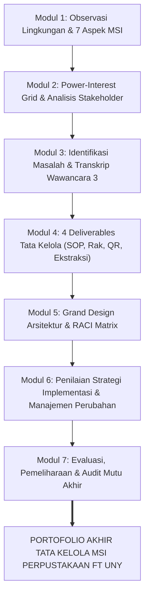

# Executive-Synthesis & Final Portfolio Skill

Skill ini memandu AI Agent dalam menyusun **Sintesis Eksekutif, Portofolio Lengkap Akhir (Modul 1 s.d. 7), dan Ringkasan Kebijakan (*Policy Brief*)** yang ditujukan kepada pimpinan fakultas (Dekanat FT UNY) serta tim penguji akademik.

---

## 📑 1. ANATOMI EXECUTIVE SUMMARY 1-LEMBAR (UNTUK DEKANAT FT UNY)

Pimpinan tingkat strategis (Dekanat) tidak membaca teknis teknis kabel atau menu software. Mereka membutuhkan ringkasan padat berformat 1 lembar yang memuat:

1. **Konteks & Urgensi**:
   - Kondisi aktual Perpustakaan FT UNY dengan 1 pustakawan tunggal melayani ribuan mahasiswa.
   - Ancaman nilai Akreditasi LAM-INFOKOM Kriteria 5 jika data sirkulasi koleksi tidak dapat dipertanggungjawabkan.
2. **Intervensi Tata Kelola Berbiaya Nol (*Zero-Cost Governance*)**:
   - Penetapan *SOP Quiet Hour* mingguan untuk proteksi waktu inventarisasi data SLiMS.
   - Penyediaan *Rak Transit Pengembalian* fisik yang dilengkapi *Signage & QR Code* formulir mandiri 4 field.
   - Pemanfaatan *Template Ekstraksi CSV SLiMS* otomatis untuk integrasi borang akreditasi.
3. **Dampak Strategis & Pengembalian Nilai (*Return on Value*)**:
   - 100% data ketersediaan buku di SLiMS terbarui dalam siklus < 24 jam.
   - Pustakawan terlindungi dari kejenuhan operasional (*burnout*).
   - Dekanat memperoleh basis data empiris kebutuhan koleksi buku untuk penetapan Rencana Anggaran Biaya (RAB) tahunan.

---

## 🗺️ 2. MATRIKS KONSOLIDASI DELIVERABLES (MODUL 1 S.D. 7)

Pastikan garis keturunan artefak terhubung utuh dari awal sampai penutupan proyek praktikum:



### Tabel Rantai Nilai Artefak

| Modul | Fokus Praktikum | Output / Artefak Kunci | Kontribusi Sistemik |
| :--- | :--- | :--- | :--- |
| **Modul 1** | Orientasi & Observasi | Profil 7 Aspek MSI Perpustakaan FT UNY | Memetakan lanskap awal organisasi. |
| **Modul 2** | Pemangku Kepentingan | Matriks *Power-Interest Grid* 4 Kuadran | Mengidentifikasi posisi Pustakawan & Dekanat. |
| **Modul 3** | Kebutuhan Informasi | 14 Temuan Wawancara Lapangan | Menetapkan akar masalah disparitas data. |
| **Modul 4** | Solusi Tata Kelola | 4 Deliverables (SOP, Rak Transit, QR, CSV) | Menghasilkan instrumen intervensi fisik & SOP. |
| **Modul 5** | Arsitektur & RACI | Grand Design Sistem & RACI Matrix | Menetapkan aliran data 3 level & tanggung jawab. |
| **Modul 6** | Strategi Implementasi | Evaluasi Strategi Modul & Mitigasi Resistensi | Merancang transisi adopsi budaya kerja. |
| **Modul 7** | Evaluasi & Audit | Metrik Keberhasilan & Panduan Pemeliharaan | Menjamin keberlanjutan sistem jangka panjang. |

---

## 📦 3. STRUKTUR BUNDEL PORTOFOLIO AKHIR MAHASISWA

Ketika menyusun Laporan Akhir / Portofolio Lengkap Kelompok 3, gunakan urutan baku:
1. **Halaman Judul & Pengesahan Kelompok** (Gantar, Ganendra, Fadlan).
2. **Ringkasan Eksekutif (Executive Summary)**.
3. **Bab I: Lanskap & Masalah Perpustakaan FT UNY** (Sintesis Modul 1–3).
4. **Bab II: Desain Solusi Tata Kelola & Arsitektur** (Sintesis Modul 4–5).
5. **Bab III: Strategi Implementasi & Manajemen Perubahan** (Sintesis Modul 6).
6. **Bab IV: Evaluasi, Metrik Kinerja, dan Rekomendasi Dekanat** (Sintesis Modul 7).
7. **Lampiran Artefak Lengkap**: SOP Resmi, Desain Signage, Template CSV, Transkrip Wawancara.

---

## 📄 4. TEMPLATE POLICY BRIEF 1-LEMBAR (SIAP CETAK DEKANAT)

Gunakan format padat berikut untuk laporan rekomendasi kebijakan kepada pimpinan:

```markdown
# EXECUTIVE POLICY BRIEF: TATA KELOLA INFORMASI PERPUSTAKAAN FT UNY
**Kepada:** Dekan & Wakil Dekan Bidang Keuangan dan Perencanaan FT UNY  
**Dari:** Tim Konsultan Tata Kelola SI (Kelompok 3 PMSI: Gantar, Ganendra, Fadlan)  
**Perihal:** Intervensi Tata Kelola Berbiaya Nol untuk Pengamanan Akreditasi LAM-INFOKOM Kriteria 5  

### 1. RINGKASAN EKSEKUTIF & MASALAH FAKTUAL
Perpustakaan FT UNY saat ini dikelola oleh 1 pustakawan tunggal yang melayani ribuan mahasiswa. Beban antrean meja sirkulasi menyebabkan proses pemutakhiran data pengembalian di SLiMS tertunda, mengakibatkan disparitas data ketersediaan buku dan terhambatnya ekstraksi data rasio pemanfaatan koleksi untuk Borang Akreditasi LAM-INFOKOM Kriteria 5.

### 2. INTERVENSI SISTEM TATA KELOLA (ZERO-BUDGET SOLUTION)
Alih-alih mengajukan pengadaan perangkat lunak baru yang mahal dan berisiko mangkrak, tim merekomendasikan 4 intervensi tata kelola:
1. **SOP Quiet Hour (SOP-001):** Alokasi resmi 30–60 menit setiap Jumat pagi (pk 08.00–09.00 WIB) untuk fokus entri data SLiMS tanpa interupsi meja layanan.
2. **Rak Transit Pengembalian (RACK-001):** Fasilitas penampung mandiri agar buku tidak menumpuk di meja kerja pustakawan.
3. **Formulir Mandiri QR Code (FORM-001):** Pencatatan ringkas 4 field via Google Form yang terintegrasi cloud sheet.
4. **Template Ekstraksi CSV (TMP-001):** Format otomatisasi ekspor data sirkulasi SLiMS langsung ke format tabel borang akreditasi.

### 3. DAMPAK & REKOMENDASI KEBIJAKAN DEKANAT
- **Kepastian Akreditasi:** Data sirkulasi tersaji akurat dan siap audit sewaktu-waktu.
- **Efisiensi Anggaran:** Intervensi berbiaya Rp 0,- (memanfaatkan rak dan akun institusi eksisting).
- **Rekomendasi:** Dekanat menerbitkan Surat Edaran penetapan jadwal SOP Quiet Hour dan mengesahkan alokasi pengadaan koleksi tahunan berbasis data ekstraksi SLiMS.
```

---

## 🔗 Navigasi Graf
> 🔗 **Terkoneksi dengan**: [[Dashboard]] | [[academic-skill]] | [[problem-solving]] | [[enterprise-architecture]] | [[defense-prep]]

