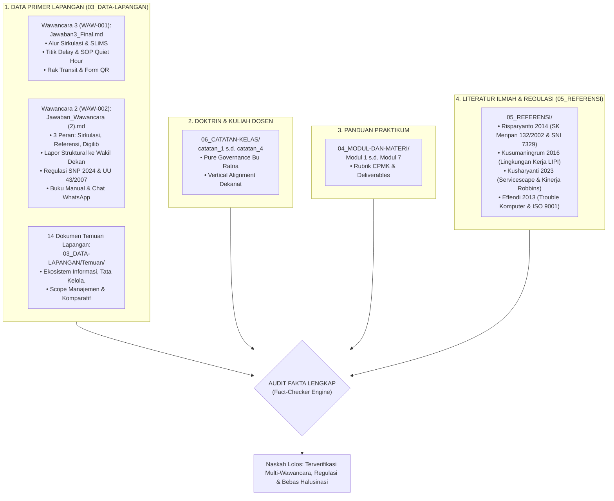

# Fact-Checker & Evidence Verification Skill

Skill ini menjamin bahwa seluruh data numerik, nama pemangku kepentingan, kendala operasional, dan usulan intervensi dalam laporan praktikum memiliki **garis keturunan bukti (*evidence lineage*) yang valid dan dapat dipertanggungjawabkan**.

---

## 🔍 1. PROTOKOL TRIANGULASI 3 TITIK SUMBER

Sebelum menulis atau mengesahkan narasi laporan, lakukan verifikasi silang (*cross-referencing*) pada 3 pilar sumber:

1. **Titik 1 (Data Lapangan Terpadu)**: Wajib menyandingkan fakta empiris dari **KEDUA WAWANCARA**:
   - [[Jawaban3_Final|Wawancara 3 (WAW-001)]]: Detail prosedur sirkulasi, verifikasi barcode, dan intervensi operasional.
   - [[Jawaban_Wawancara (2)|Wawancara 2 (WAW-002)]]: Konteks 3 beban peran pustakawan (Sirkulasi, Referensi, Digilib), pelaporan ke Wakil Dekan, koordinasi ke Perpus Pusat, dan standar akreditasi BAN-PT/LAM Teknik.
   - Folder [[Ekosistem Informasi Perpustakaan FT|Temuan Lapangan (03_DATA-LAPANGAN/Temuan/)]]: Matriks stakeholder, tata kelola data, dan esensi SIM.
2. **Titik 2 (Teori & Catatan Kuliah)**: Merujuk pada arahan Bu Ratna di [[catatan_1]] s.d. [[catatan_4]].
3. **Titik 3 (Koridor Modul)**: Mematuhi batasan rubrik dan struktur deliverables pada modul praktikum terkait.
4. **Titik 4 (Literatur Ilmiah & Regulasi)**: Menguatkan argumen manajerial dengan 4 jurnal ilmiah terakreditasi di `05_REFERENSI` serta payung hukum UU 43/2007, SK Menpan 132/2002, dan SNI 7329:2009.

---

## 🚫 2. DAFTAR HITAM HALUSINASI (BLACKLIST OF FICTIONAL CLAIMS)

Dosen pengampu (Bu Ratna) sangat teliti terhadap data karangan. **DILARANG KERAS** memunculkan klaim berikut tanpa bukti tertulis:

| Klaim Halusinasi (DILARANG) | Fakta Riil Lapangan (WAJIB DIGUNAKAN) | Rujukan Sumber |
| :--- | :--- | :--- |
| *"Perpustakaan menambah 2 orang staf magang tetap untuk input data"* | **Staf perpustakaan hanya 1 orang (Pustakawan Tunggal)** yang merangkap 3 layanan: Sirkulasi, Referensi, dan Digital Library. Bantuan magang bersifat insidental saat ada PKL. | [[Jawaban_Wawancara (2)]] Poin 8-9 & [[Jawaban3_Final]] |
| *"Tersedia anggaran fakultas Rp 25.000.000 untuk pengadaan software"* | **Tidak ada anggaran belanja software tambahan**; pengadaan hanya untuk buku fisik tahunan via usulan ke Dekanat. Anggaran fakultas terbatas. | [[Jawaban_Wawancara (2)]] Poin 10C & [[catatan_4]] |
| *"Pustakawan melapor ke rektorat universitas"* | Pustakawan melapor secara struktural ke **Wakil Dekan FT UNY** dan berkoordinasi teknis/fungsional dengan **Perpustakaan Pusat UNY**. | [[Jawaban_Wawancara (2)]] Poin 9 |
| *"Quiet Hour dilaksanakan setiap hari selama 3 jam penuh"* | Quiet Hour dibatasi secara realistis: **30–60 menit pada jam sepi (Jumat pagi pk 08.00–09.00 WIB)** agar tidak mengganggu layanan. | [[Jawaban3_Final]] Poin 3 |
| *"Google Form memiliki 15 isian lengkap termasuk upload foto"* | Google Form dirancang ringkas dengan **4 field wajib**: Nama/NIM, Judul Buku, Barcode/No Induk, dan Tanggal Pengembalian. | [[Praktikum_4_Kelompok3_revisi]] & [[Jawaban3_Final]] Poin 9 |
| *"Mahasiswa kelompok kami menginstal modul custom ke source code SLiMS pusat"* | Mahasiswa **TIDAK mengubah source code SLiMS**; integrasi data dilakukan murni via fitur bawaan *Export CSV/Excel*. | [[catatan_4]] & [[Jawaban_Wawancara (2)]] Poin 2 |

---

## 🏷️ 3. TAKSONOMI PENANDAAN STATUS INFORMASI

Jika dalam analisis dibutuhkan estimasi manajerial yang belum disebutkan secara eksplisit di transkrip wawancara, gunakan notasi transparan berikut:

- `[FACT: Wawancara 2]` : Fakta dari Wawancara 2 (Beban 3 layanan, Wakil Dekan, regulasi SNP/UU 43, WhatsApp).
- `[FACT: Wawancara 3]` : Fakta dari Wawancara 3 (Detail sirkulasi, SOP Quiet Hour, Rak Transit, 4 field Form QR).
- `[FACT: Temuan]` : Analisis dari 14 dokumen temuan di `03_DATA-LAPANGAN/Temuan/`.
- `[DOCTRINE: Bu Ratna]` : Prinsip tata kelola dan 7 Aspek MSI yang diajarkan dosen di kelas.
- `[ASSUMPTION: Terkendali]` : Estimasi rasional berdasar observasi lingkungan FT UNY (misal: durasi input data 2–3 menit per eksemplar).
- `[SOURCE MISSING]` : Informasi belum memiliki rujukan; **wajib ditelusuri atau dihapus** sebelum finalisasi laporan.

---

## 🗂️ 4. INDEKS BUKTI KEDUA WAWANCARA LAPANGAN

### A. Indeks Wawancara 2: Konteks Organisasi & Beban 3 Layanan (`Jawaban_Wawancara (2).md`)
- **Poin 1**: Pengelolaan data semi-manual; data koleksi, anggota, dan sirkulasi diinput bertahap di sela pelayanan langsung.
- **Poin 2**: Media yang dipakai adalah SLiMS, buku catatan manual saat darurat, dan WhatsApp untuk perpanjangan pinjam/referensi.
- **Poin 3**: Data yang paling sering dibutuhkan: keanggotaan aktif, status ketersediaan koleksi di rak, transaksi sirkulasi, dan statistik pimpinan.
- **Poin 4**: Akar hambatan waktu: 1 orang menangani **3 jenis layanan (Sirkulasi, Referensi, dan Digital Library)**.
- **Poin 5**: Sering terjadi keterlambatan update data anggota saat ganti semester dan data buku rusak/hilang.
- **Poin 6**: Dampak: pelayanan melambat karena harus cek manual fisik, dan laporan pimpinan fakultas kurang akurat.
- **Poin 7**: Cara petugas saat ini: *cross-check manual* catatan fisik vs sistem SLiMS, memprioritaskan peminjaman aktif.
- **Poin 8**: Penyebab utama: beban kerja tinggi, sistem belum terintegrasi otomatis, dan ketiadaan staf pembantu tetap.
- **Poin 9**: Garis komando: Bertanggung jawab ke **Wakil Dekan FT UNY**; koordinasi teknis ke Perpustakaan Pusat UNY.
- **Poin 10**: Lingkungan bisnis: UU No. 43/2007, SNP No. 5/2024, borang akreditasi BAN-PT/LAM Teknik, anggaran fakultas terbatas.

### B. Indeks Wawancara 3: Alur Sirkulasi, SOP & Formulir QR (`Jawaban3_Final.md`)

Gunakan jangkar nomor butir wawancara ini saat mereferensikan klaim operasional:

| Butir Wawancara | Topik Operasional Lapangan | Fakta Kunci & Kutipan Inti | Implikasi Solusi Tata Kelola |
| :---: | :--- | :--- | :--- |
| **Poin 1** | Alur Aktual Pemutakhiran | Informasi diterima pustakawan tunggal; diperiksa fisik lalu diupdate di SLiMS. | Alur linear tapi mudah terputus saat antrean ramai. |
| **Poin 2** | Titik Keterlambatan Utama | Keterlambatan terjadi **sebelum verifikasi dan saat pemutakhiran data SLiMS**. | Membutuhkan *SOP Quiet Hour* sebagai jeda proteksi. |
| **Poin 3** | Ketiadaan Jadwal Khusus | Belum ada jadwal pemutakhiran berkala yang pasti; usulan jadwal realistis adalah mingguan. | Penetapan jadwal Jumat pagi pk 08.00–09.00 WIB. |
| **Poin 4** | Mekanisme Verifikasi | Verifikasi fisik mencocokkan nomor barcode buku dengan data di layar SLiMS. | Perlunya *Rak Transit* agar buku tertata rapi saat verifikasi. |
| **Poin 5** | Pencatatan Sementara | Menggunakan catatan kertas manual yang rawan terselip/hilang. | Digantikan oleh *Google Sheets* otomatis via QR Code. |
| **Poin 6** | Kewenangan di SLiMS | Pustakawan berwenang penuh mengubah status eksemplar lokal (tersedia, dipinjam, transit). | Tidak perlu mengubah hak akses atau database pusat. |
| **Poin 7** | Keterlibatan Pihak Luar | Penghapusan koleksi (*weeding*) harus seizin Perpustakaan Pusat & Pimpinan Fakultas. | Batasan wewenang dijaga; fokus solusi pada sirkulasi lokal. |
| **Poin 8** | Kelayakan QR Code / Form | Pustakawan menyambut baik form digital asalkan ringkas dan tidak membebani. | Menjadi dasar perancangan *Google Form QR Code*. |
| **Poin 9** | Form Wajib Ringkas | Informasi minimum: Identitas pemustaka, judul buku, barcode, dan tanggal. | Dibatasi baku pada **4 field wajib**. |
| **Poin 10** | Alur Tindak Lanjut | Penerimaan laporan -> verifikasi fisik -> update SLiMS -> penutupan log. | Dimodelkan dalam *Mermaid Sequence Diagram*. |
| **Poin 11** | Monitoring Laporan | Butuh melihat log rekapitulasi mana yang sudah diverifikasi dan belum. | Indikator status di *Google Sheets* (Pending / Processed). |
| **Poin 12** | Kebutuhan Laporan Berkala | Rekapitulasi triwulanan/semesteran untuk borang akreditasi fakultas. | Integrasi ke *Template Ekstraksi LAM-INFOKOM Kriteria 5*. |

---

## ✅ 5. CHECKLIST AUDIT FAKTA SEBELUM PENYERAHAN LAPORAN

- [ ] Apakah nama subjek pemustaka dan pustakawan konsisten dengan data riil?
- [ ] Apakah seluruh angka durasi, persentase, atau frekuensi bersumber dari dokumen resmi atau estimasi berlabel `[ASSUMPTION]`?
- [ ] Apakah tidak ada solusi penyelundupan coding aplikasi (*Solution Smuggling*)?
- [ ] Apakah 4 deliverable utama (SOP Quiet Hour, Rak Transit, Form QR, Template SLiMS) konsisten namanya di seluruh bab?

---

## 🔗 Navigasi Graf
> 🔗 **Terkoneksi dengan**: [[Dashboard]] | [[academic-skill]] | [[problem-solving]] | [[self-audit]] | [[revisi]]
