# Information-Routing & Content Taxonomy Skill

Skill ini memberikan instruksi navigasi presisi bagi AI Agent agar tidak salah kamar (*zero misplaced files/content*), mampu menempatkan setiap argumen pada bab yang tepat dalam struktur 7 Bagian baku, serta menegakkan konvensi penamaan (*naming convention*) repositori.

---

## 🗂️ 1. YURISDIKSI DAN BATAS FOLDER REPOSITORI

Setiap file di dalam proyek memiliki folder resmi yang tidak boleh dilanggar:

```mermaid
flowchart TD
    Root["Root Repositori"] --> D0["00_DASHBOARD (Jantung Navigasi Utama: Dashboard.md)"]
    Root --> D1["01_AGENT (Aturan Operasional & Katalog Skill Agent)"]
    Root --> D2["02_LAPORAN (Naskah Resmi Laporan Praktikum Modul 1-7)"]
    Root --> D3["03_SUMBER-DATA (Transkrip Wawancara & Observasi Riil)"]
    Root --> D4["04_MODUL-DAN-MATERI (Panduan Resmi Praktikum dari Dosen)"]
    Root --> D5["05_DOKUMENTASI (Log Eksekusi & Catatan Proyek)"]
    Root --> D6["06_CATATAN-KELAS (Notulensi Kuliah & Feedback Bu Ratna)"]
    Root --> D7["07_REVISI (Dokumen Log Histori Perubahan Substansial)"]
    Root --> D8["08_ARTEFAK (Instrumen Operasional: SOP, Form, Signage, Template)"]
    Root --> D9["09_SOURCE-FILES (Inventori Sumber & Graf Pengetahuan)"]
```

### Aturan Penempatan File:
1. **`02_LAPORAN/`**: Khusus naskah utuh laporan praktikum (`Praktikum_X_Kelompok3.md`). **Dilarang** menaruh catatan ringkas atau dokumen mentah di sini.
2. **`07_REVISI/`**: Khusus dokumen pelacak perubahan (*change-log*) dan audit histori. Jika naskah laporan direvisi, naskah final tetap di `02_LAPORAN/`, sedangkan alasan dan rekaman perubahannya dicatat di `07_REVISI/`.
3. **`08_ARTEFAK/`**: Khusus file mandiri operasional yang dapat dicetak/digunakan langsung (contoh: teks SOP final, template borang CSV, materi signage).

---

## 📑 2. ROUTING KONTEN STRUKTUR 7 BAGIAN LAPORAN

Ketika menulis atau mengedit laporan praktikum, tempatkan setiap informasi sesuai fungsinya agar tidak tercampur:

| Bagian Laporan | Jenis Informasi yang Wajib Masuk | Informasi yang DILARANG Masuk (Salah Kamar) |
| :--- | :--- | :--- |
| **1. Identitas Kegiatan** | Judul modul, waktu, tempat, anggota tim (Gantar, Ganendra, Fadlan). | Narasi latar belakang atau keluhan operasional. |
| **2. Tujuan Kegiatan** | 3–4 butir tujuan kompetensi spesifik modul. | Rincian teknis solusi atau pembahasan teori. |
| **3. Uraian Masalah** | **Fakta empiris lapangan**, data transkrip wawancara, gejala sirkulasi. | Usulan solusi (jangan menyelundupkan solusi di sini!). |
| **4. Hasil & Artefak** | **Blueprint, Grand Design, RACI, SOP, Form QR, Template CSV**. | Keluhan kendala atau spekulasi masa depan. |
| **5. Kendala & Solusi** | Hambatan teknis/manajerial riil dan mitigasi konkretnya. | Kesimpulan umum atau rangkuman teori. |
| **6. Refleksi Pembelajaran** | *Lessons learned*, kesadaran filosofis tata kelola vs koding, nilai kelompok. | Pengulangan poin hasil teknis. |
| **7. Kesimpulan & Saran** | Sintesis akhir 3 tingkat organisasi (Operasional, Manajerial, Strategis). | Pengenalan isu baru yang tidak pernah dibahas di Bab 3–5. |

---

## 🏷️ 3. STANDAR PENAMAAN (NAMING CONVENTION) RESMI

Untuk menjaga kerapian repositori dan integritas graf:
- **Laporan Utama**: `Praktikum_[NomorModul]_Kelompok3.md` (contoh: `Praktikum_5_Kelompok3.md`).
- **File Revisi Khusus**: Tambahkan suffix `_revisi.md` jika merupakan versi paralel (contoh: `Praktikum_4_Kelompok3_revisi.md`).
- **Kodefikasi Artefak**:
  - `SOP-001` : Standar Operasional Prosedur Pemutakhiran Data & Quiet Hour
  - `RACK-001` : Panduan Alur Fisik & Signage Rak Transit Pengembalian
  - `FORM-001` : Desain Formulir QR Code Google Form Pencatatan Mandiri
  - `TMP-001` : Template Ekstraksi Data Sirkulasi SLiMS ke Borang LAM-INFOKOM

---

## 🔗 Navigasi Graf
> 🔗 **Terkoneksi dengan**: [[Dashboard]] | [[academic-skill]] | [[buat-modul]] | [[revisi]] | [[self-healing]]
