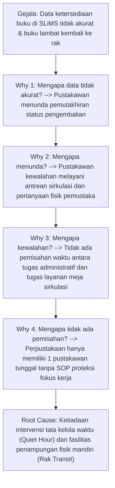
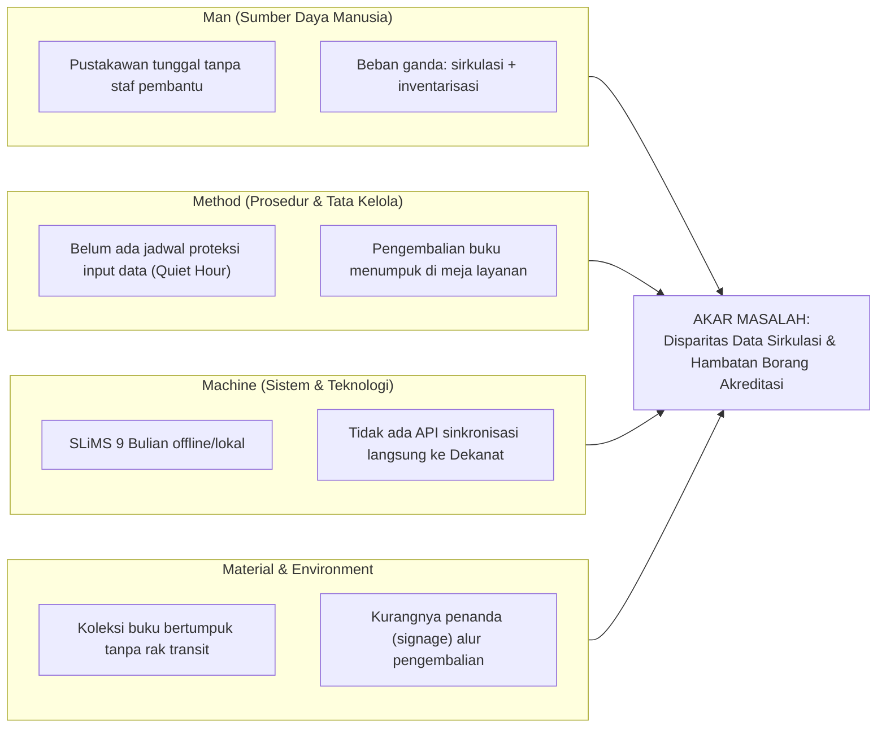

# Problem-Solving & Systemic Reasoning Skill

Skill ini memberikan kerangka kerja analitis dan penalaran mendalam (*first-principles thinking*) bagi AI Agent untuk membedah masalah organisasi perpustakaan, mengurai akar masalah hingga tuntas, dan membuktikan keunggulan solusi tata kelola (*Pure Governance*) secara logis dan terstruktur.

---

## 🧠 1. PRINSIP FIRST-PRINCIPLES & 5-WHYS ANALYSIS

Ketika menghadapi masalah di Perpustakaan FT UNY, jangan berhenti pada gejala permukaan (*symptoms*). Terapkan metode **5-Whys** untuk menemukan akar masalah terdalam (*root cause*):

---

## 🐟 2. DIAGRAM ISHIKAWA (FISHBONE DIAGRAM) PERPUSTAKAAN FT UNY

Dalam menyusun Bab *Kendala & Solusi* serta *Refleksi*, gunakan kategorisasi 4M (Man, Method, Machine, Material) untuk memastikan analisis tidak sepihak:

---

## ⚖️ 3. MATRIKS PERTIMBANGAN KEPUTUSAN (TRADE-OFF MATRIX)

Ketika mempertahankan mengapa kita memilih **Solusi Tata Kelola (SOP & Fasilitas Fisik)** daripada **Solusi Pembuatan Aplikasi Baru (Koding Web/Mobile)**:

| Parameter Evaluasi | Solusi A: Koding Web/App Baru | Solusi B: Tata Kelola Terintegrasi (SOP, Rak Transit, QR Form) | Alasan Keputusan Logis |
| :--- | :--- | :--- | :--- |
| **Biaya Finansial (*Cost*)** | Tinggi (pengadaan server, lisensi, dev fee) | **Nol / Sangat Rendah** (memanfaatkan Google Form & rak eksisting) | Solusi B tidak membebani anggaran terbatas FT UNY. |
| **Waktu Penerapan (*Time-to-Value*)** | 3–6 bulan (tahap dev, uji bug, deployment) | **1–2 minggu** (sosialisasi SOP & penempelan QR code) | Solusi B menyelesaikan masalah penumpukan buku seketika. |
| **Regulasi & Otoritas Kampus** | Rumit (wajib izin UPT TIK UNY & audit keamanan) | **Otonom Fakultas** (cukup persetujuan Kepala Perpus & Dekanat) | Solusi B tidak melanggar batasan yurisdiksi SI universitas. |
| **Beban Pustakawan Tunggal** | Bertambah (harus belajar sistem baru & mitigasi error) | **Berkurang** (terlindungi SOP Quiet Hour & form mandiri pemustaka) | Solusi B menurunkan *cognitive load* pustakawan. |
| **Dampak Borang Akreditasi** | Belum tentu siap saat audit | **Langsung Siap** (template ekstraksi CSV SLiMS ke borang LAM-INFOKOM) | Solusi B menjawab kebutuhan Kriteria 5 akreditasi. |

> 📌 **Kesimpulan Logika**: *Pilihan Tata Kelola (Solusi B) adalah keputusan paling rasional dan strategis berdasarkan rasio biaya-dampak organisasi riil.*

---

## 🧩 4. PRINSIP DEKOMPOSISI MECE (MUTUALLY EXCLUSIVE, COLLECTIVELY EXHAUSTIVE)

Setiap merumuskan kategori kendala, dampak, atau arsitektur solusi, pastikan:
1. **Mutually Exclusive (Tidak Tumpang Tindih)**: Kategori A tidak boleh memuat poin yang sudah ada di Kategori B.
2. **Collectively Exhaustive (Menyeluruh Tanpa Celah)**: Total seluruh kategori mencakup keseluruhan ekosistem:
   - **Dimensi Manusia**: Pelatihan, beban kerja, dan koordinasi tim.
   - **Dimensi Proses**: SOP Quiet Hour, alur rak transit, formulir QR code.
   - **Dimensi Data & Sistem**: Rekap Google Form, SLiMS 9 Bulian, Borang LAM-INFOKOM.
---

## 🎯 5. TIGA STUDI KASUS 5-WHYS OPERASIONAL PERPUSTAKAAN FT UNY

Terapkan dekomposisi logika ini saat menulis Bab Kendala & Solusi pada setiap modul:

### Kasus A: Keterlambatan Pemutakhiran SLiMS (Problem Penjadwalan)
- **Gejala**: Status buku di OPAC masih 'Tersedia' padahal sedang dipinjam atau dalam proses kembali.
- **Why 1**: Pustakawan baru menginput data di penghujung hari atau hari berikutnya.
- **Why 2**: Pustakawan melayani mahasiswa satu per satu di meja sirkulasi sepanjang jam buka.
- **Why 3**: Tidak ada batasan resmi kapan pustakawan boleh fokus mengerjakan tugas entri data.
- **Why 4**: Pustakawan merasa bersalah jika menolak melayani mahasiswa yang datang ke meja.
- **Solusi Tata Kelola**: `SOP-001 (SOP Quiet Hour)` melegitimasi hak pustakawan untuk menutup layanan meja sirkulasi sementara selama 30–60 menit pada jam sepi resmi (Jumat pagi pk 08.00–09.00 WIB) dengan dukungan SK Kepala Perpustakaan.

### Kasus B: Penumpukan Fisik Buku di Meja Layanan (Problem Tata Ruang)
- **Gejala**: Buku-buku yang dikembalikan menggunung di atas meja kerja pustakawan.
- **Why 1**: Pemustaka langsung meletakkan buku di meja petugas karena tidak tahu harus ditaruh di mana.
- **Why 2**: Tidak ada sarana penampung mandiri sebelum buku diverifikasi dan dikembalikan ke rak utama (*shelving*).
- **Why 3**: Meja sirkulasi merangkap fungsi sebagai meja penerimaan, meja verifikasi, dan meja entri data.
- **Solusi Tata Kelola**: `RACK-001 (Rak Transit Pengembalian)` memisahkan zonasi fisik pengembalian dari meja kerja, dilengkapi papan petunjuk (*signage*) alur mandiri.

### Kasus C: Distorsi Data Borang Akreditasi (Problem Aliran Informasi)
- **Gejala**: Tim Akreditasi Prodi kesulitan mendapatkan angka rasio pemanfaatan pustaka yang valid.
- **Why 1**: Laporan sirkulasi tahunan di SLiMS tidak pernah direkap secara teratur per semester.
- **Why 2**: Format output bawaan SLiMS tidak langsung cocok dengan tabel Borang LAM-INFOKOM Kriteria 5.
- **Why 3**: Pustakawan tidak memiliki keahlian atau waktu untuk memformat ulang data mentah SQL/CSV.
- **Solusi Tata Kelola**: `TMP-001 (Template Ekstraksi CSV SLiMS)` menyediakan lembar kerja spreadsheet yang sudah dipetakan rumusnya, sehingga pustakawan cukup mengekspor CSV dari SLiMS dan menempelkannya untuk menghasilkan laporan borang siap pakai.

---

## 🔗 Navigasi Graf
> 🔗 **Terkoneksi dengan**: [[Dashboard]] | [[academic-skill]] | [[self-audit]] | [[enterprise-architecture]] | [[change-management]]
