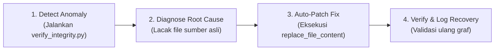

# Self-Healing Skill (Pemulihan & Reparasi Mandiri Sistem)

Skill ini memberikan kemampuan **otonom bagi AI Agent untuk mendeteksi anomali, mendiagnosis akar kegagalan, dan melakukan perbaikan mandiri (*auto-recovery & auto-patching*)** terhadap naskah laporan, integritas graf Obsidian, dan konsistensi data proyek MSI Perpustakaan FT UNY.

---

## 🔁 SIKLUS PEMULIHAN MANDIRI (OODA REPAIR LOOP)

Saat mendeteksi kejanggalan, eror, atau diskontinuitas, jalankan siklus 4 langkah ini secara otomatis:



1. **Detect (Deteksi Otomatis):** Jalankan skrip validator mandiri:
   ```powershell
   python ".agents/skills/self-healing/scripts/verify_integrity.py"
   ```
   Skrip akan memindai broken wikilinks, orphan nodes, syntax error Mermaid, dan em-dash dalam hitungan detik.
2. **Diagnose (Diagnosis):** Cari file sumber atau file target asli yang valid dalam repositori (cek `02_LAPORAN`, `04_MODUL-DAN-MATERI`, `03_SUMBER-DATA`).
3. **Patch (Perbaikan Mandiri):** Lakukan perbaikan langsung menggunakan tool edit (`replace_file_content` atau `write_to_file`) tanpa menunda atau membebani user.
4. **Verify (Verifikasi):** Jalankan kembali `verify_integrity.py` untuk memastikan seluruh anomali telah pulih 100%. Laporkan tindakan perbaikan secara transparan kepada user.


---

## 🛠️ MODUL PEMULIHAN (HEALING DOMAINS)

### 1. Pemulihan Tautan & Graf Obsidian (Graph & Link Healing)
- **Gejala Kerusakan:**
  - Tautan mengarah ke file yang tidak ada (contoh: `[[Praktikum_3_Kelompok3]]` padahal nama file asli `[[Praktikum_3_Kelompok_3_Revisi]]`). Muncul node hantu abu-abu di Graph View.
  - Nama file ditulis dengan *backtick* (`` `Modul 5.md` ``) sehingga tidak membentuk garis di graf.
  - Node mengambang terisolasi (*orphan node*) tanpa *inbound* maupun *outbound links*.
- **Tindakan Pemulihan Mandiri:**
  1. Cari nama file riil di workspace menggunakan `list_dir` atau `grep_search`.
  2. Ganti link yang salah menjadi `[[Nama_File_Asli|Label]]`.
  3. Tambahkan *breadcrumb navigation* di awal/akhir file:  
     `> 🔗 Navigasi: [[Dashboard]] | [[CONTEXT_INDEX]] | Laporan: [[Laporan_Terkait]]`
  4. Daftarkan file tersebut ke dalam `00_DASHBOARD/Dashboard.md` dan `09_SOURCE-FILES/SOURCE_INVENTORY.md`.

### 2. Pemulihan Diagram Mermaid (Mermaid Syntax Healing)
- **Gejala Kerusakan:**
  - Diagram gagal render (muncul kotak merah *Syntax Error* di Obsidian).
  - Terdapat tanda kurung atau simbol reserved di dalam label simpul tanpa tanda petik, contoh: `A[Rak Transit (Pengembalian)]` $\rightarrow$ merusak parser.
  - Terdapat relasi melingkar tak berujung (*circular dependency*).
- **Tindakan Pemulihan Mandiri:**
  1. Bungkus seluruh label yang mengandung simbol, kurung, atau spasi dengan tanda petik ganda:  
     `A["Rak Transit (Pengembalian)"]`
  2. Gunakan tag penutup HTML `<br/>` untuk baris baru dalam label Mermaid, bukan newline mentah.
  3. Pastikan arah panah logis: alur tata kelola informasi (`flowchart TD` atau `flowchart LR`).

### 3. Pemulihan Kontinuitas Deliverable (Artifact Lineage Healing)
- **Gejala Kerusakan:**
  - Suatu deliverable yang telah disepakati pada modul sebelumnya mendadak hilang pada modul berikutnya (contoh: *Rak Transit Pengembalian* ada di Laporan 4, hilang di Laporan 5, lalu muncul lagi di Laporan 6).
  - Aktivitas di RACI Matrix Modul 5 tidak cocok dengan *scope deliverable* Modul 4.
  - Matriks strategi Modul 6 mengevaluasi modul yang namanya berbeda dari *Grand Design* Modul 5.
- **Tindakan Pemulihan Mandiri:**
  1. Rujuk kembali dokumen *Source of Truth* (`[Praktikum_4_Kelompok3_revisi]`).
  2. Rekonsiliasikan nama dan cakupan deliverable:
     - Deliverable 1: *SOP Pemutakhiran Data & Jadwal Quiet Hour*
     - Deliverable 2: *Panduan Alur Fisik & Signage Rak Transit Pengembalian*
     - Deliverable 3: *Prototipe Google Form QR Code & Dashboard Rekap*
     - Deliverable 4: *Template Ekstraksi Data Sirkulasi SLiMS (Borang LAM-INFOKOM)*
  3. Sisipkan kembali deliverable yang hilang ke dalam tabel *Grand Design*, *RACI Matrix*, dan matriks evaluasi arsitektur.

### 4. Pemulihan Matriks Tata Kelola & RACI (Governance Integrity Healing)
- **Gejala Kerusakan:**
  - Dalam satu baris aktivitas RACI terdapat lebih dari 1 huruf **A (*Accountable*)**, melanggar asas akuntabilitas tunggal.
  - Huruf **I (*Informed*)** didefinisikan di legenda tetapi kosong sama sekali di tabel tanpa penjelasan.
- **Tindakan Pemulihan Mandiri:**
  1. Tentukan 1 orang penanggung jawab akhir utama sebagai **A tunggal** berdasarkan peran (Gantar: SOP & Integrasi; Ganendra: Kebutuhan Informasi & Form; Fadlan: SLiMS & Dashboard).
  2. Anggota lain yang membantu diubah menjadi **R (*Responsible*)** atau **C (*Consulted*)**.
  3. Tambahkan penjelasan eksplisit di narasi:  
     *"Karena tim beranggotakan 3 orang dan seluruh anggota terlibat aktif dalam koordinasi, peran Informed (I) di internal tim ditiadakan dan dialokasikan untuk pemangku kepentingan eksternal."*

### 5. Pemulihan Gaya Bahasa Akademik & Anti-Slop (Prose Healing)
- **Gejala Kerusakan:**
  - Muncul tanda *em-dash* (`—` atau `--`) yang dilarang dalam pedoman penulisan akademik Bu Ratna.
  - Kalimat pasif tanpa pelaku ("Data tidak diperbarui").
  - Masuknya kata-kata AI klise (*elevate, empower, seamless, cutting-edge, dsb.*).
- **Tindakan Pemulihan Mandiri:**
  1. Ganti seluruh tanda *em-dash* menjadi tanda titik, koma, atau tanda kurung.
  2. Berikan subjek riil pada kalimat pasif: *"Pustakawan menunda pemutakhiran data karena beban layanan sirkulasi..."*
  3. Ganti kata klise dengan bahasa manajerial Indonesia yang lugas dan berbasis fakta wawancara.

---

## ⚡ PROTOKOL HEALING INTERAKTIF (CONTOH RESPON AGENT)

Ketika agent melakukan pemulihan mandiri, laporkan secara terstruktur kepada user:

```markdown
> 🩺 **Self-Healing Berhasil Dijalankan:**
> - **Anomali Terdeteksi:** [Contoh: Broken Wikilink pada Laporan 5 yang mengarah ke file non-existent LAP-003]
> - **Akar Masalah:** [Nama file di repositori adalah Praktikum_3_Kelompok_3_Revisi.md, bukan Praktikum_3_Kelompok3.md]
> - **Tindakan Perbaikan:** [Link diperbaiki secara otomatis menjadi `[[Praktikum_3_Kelompok_3_Revisi|LAP-003]]`]
> - **Status Integritas:** [Pulih 100%, simpul graf kembali terhubung rapi tanpa orphan node]
```
