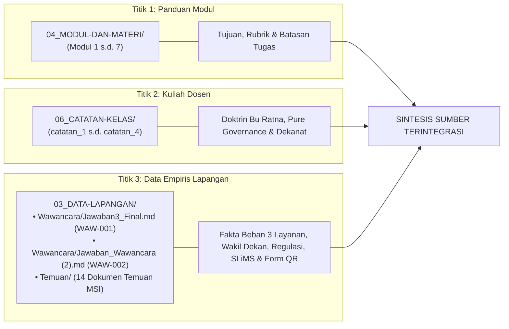
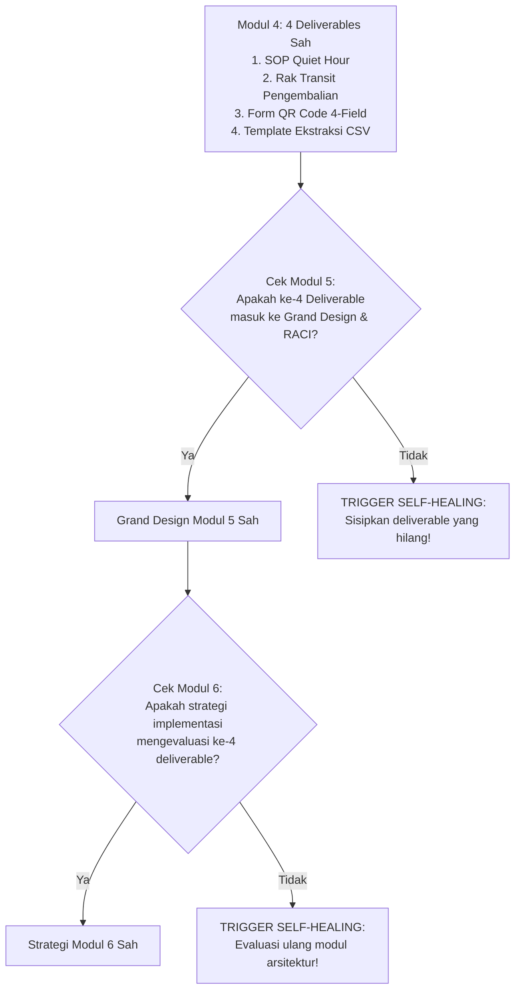

# Source-Retrieval & Evidence Hunting Skill

Skill ini memandu AI Agent untuk secara agresif dan terstruktur menelusuri seluruh sumber bukti di repositori sebelum menyusun analisis, mencegah kebutaan konteks (*blindspot*), dan menghubungkan setiap klaim dengan tautan wikilink yang sahih.

---

## 🎯 1. PROTOKOL INVESTIGASI 3 TITIK (TRIANGULASI WAJIB)

Setiap kali merumuskan atau merevisi satu bagian laporan, agent secara refleks wajib memeriksa 3 sumber primer:

### Algoritma Pencarian Sumber:
1. **Periksa Batasan Modul**: Buka `04_MODUL-DAN-MATERI/Modul X.md` untuk mengetahui apa keluaran wajib yang diminta dosen.
2. **Cek Doktrin Dosen**: Buka `06_CATATAN-KELAS/catatan_X.md` untuk melihat arahan khusus Bu Ratna (Pure Governance, penyelarasan Dekanat, dll).
3. **Validasi Data Lapangan (Multi-File)**:
   - Cek `03_DATA-LAPANGAN/Wawancara/Jawaban_Wawancara (2).md` untuk konteks 3 beban peran pustakawan (Sirkulasi, Referensi, Digilib), garis hierarki ke Wakil Dekan FT UNY, hubungan ke Perpus Pusat, dan standar akreditasi BAN-PT/LAM Teknik.
   - Cek `03_DATA-LAPANGAN/Wawancara/Jawaban3_Final.md` untuk detail sirkulasi, titik keterlambatan, SOP Quiet Hour, Rak Transit, dan Google Form QR.
   - Cek folder `03_DATA-LAPANGAN/Temuan/` untuk referensi analisis ekosistem, tata kelola data, dan ruang lingkup TI.

---

## 📡 2. RADAR INDEKS REPOSITORI (INDEX SCANNING)

Agent tidak boleh menebak isi repositori. Gunakan file indeks navigasi berikut sebagai kompas pencarian:
- [[SOURCE_INVENTORY.md]]: Daftar seluruh 97 file repositori, status verifikasi, dan lokasi folder.
- [[KNOWLEDGE_GRAPH.md]]: Peta keterhubungan konseptual antar-modul, temuan lapangan, dan 4 jurnal ilmiah.
- [[THEORY_TO_EVIDENCE_MATRIX.md]]: Matriks pemetaan teori 7 modul dan 4 jurnal riset terhadap bukti lapangan.
- [[Dashboard.md]]: Hub navigasi sentral untuk melihat status proyek terkini.
- `05_REFERENSI/`: 4 Jurnal ilmiah terakreditasi (Risparyanto 2014, Kusumaningrum et al. 2016, Kusharyanti et al. 2023, Effendi et al. 2013) serta data profil SLiMS & Glosarium.

---

## 🛡️ 3. PROTOKOL ANTI-BLINDSPOT (PELACAKAN GARIS KETURUNAN DELIVERABLES)

Mencegah agent "lupa" terhadap artefak yang telah disahkan pada modul-modul sebelumnya:

---

## 🔗 Navigasi Graf
> 🔗 **Terkoneksi dengan**: [[Dashboard]] | [[fact-checker]] | [[academic-skill]] | [[revisi]] | [[obsidian-graph]]
