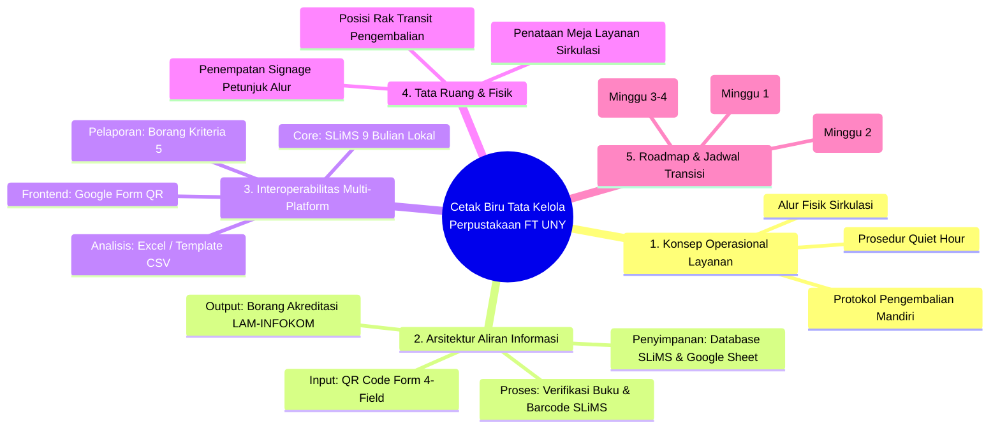
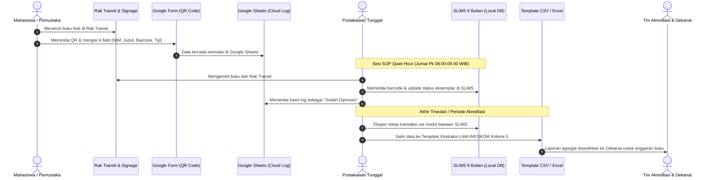

# System-Blueprint & Solution Architecture Skill

Skill ini memandu AI Agent dalam merancang **Cetak Biru (*System Blueprint*) Tata Kelola Sistem Informasi Perpustakaan FT UNY** secara komprehensif, mencakup konsep operasional, alur informasi, interoperabilitas multi-sistem, dan tata ruang fisik layanan.

---

## 📐 1. ANATOMI CETAK BIRU TATA KELOLA SISTEM (SYSTEM BLUEPRINT)

Sebuah cetak biru (*blueprint*) sistem informasi di bidang tata kelola harus memuat 5 dimensi utama:



---

## 🔄 2. BLUEPRINT INTEROPERABILITAS MULTI-PLATFORM (DATA FLOW)

Pemetaan pertukaran data tanpa modifikasi source code SLiMS (*Zero-Code Interoperability*):



---

## 🏛️ 3. BLUEPRINT TATA RUANG FISIK & FASILITAS (SPATIAL BLUEPRINT)

Perancangan tata kelola fasilitas fisik untuk mengurai kemacetan meja sirkulasi:

```
[ PINTU MASUK PERPUSTAKAAN ]
            │
            ├───> [ SIGNAGE UTAMA: PANDUAN PENGEMBALIAN & PINJAM ]
            │
            ├───> [ RAK TRANSIT PENGEMBALIAN (RACK-001) ]
            │         └── Dilengkapi Akrilik QR Code Form & Petunjuk 4 Langkah
            │
            └───> [ MEJA LAYANAN SIRKULASI ]
                      ├── PC Desktop (SLiMS 9 Bulian)
                      ├── Barcode Scanner USB
                      └── Pustakawan Tunggal (Bebas dari tumpukan buku kembali)
```

---

## 📑 4. TEMPLATE KELUARAN CETAK BIRU SISTEM

Setiap kali diminta membuat cetak biru (*blueprint*) pada Modul 4, 5, atau 6, pastikan dokumen memuat:
1. **Nama & Kode Blueprint** (misal: `BP-MSI-001: Cetak Biru Tata Kelola Sirkulasi Mandiri`).
2. **Konteks & Batasan Organisasi** (1 pustakawan tunggal, tanpa biaya perangkat lunak baru).
3. **Diagram Alur Informasi (Mermaid Sequence / Flowchart)**.
4. **Matriks Spesifikasi Komponen (SOP, Form, Rak, Spreadsheet)**.
5. **Rencana Mitigasi Risiko Kegagalan Operasional**.

---

## 🛡️ 5. PROTOKOL KONTINJENSI OPERASIONAL & RESILIENSI SISTEM

Cetak biru tata kelola harus memiliki ketahanan tinggi (*high resilience*) terhadap anomali di lapangan tanpa mengubah esensi solusi berbiaya nol:

| Kondisi Anomali / Gangguan | Dampak Potensial | Protokol Mitigasi Cetak Biru (SOP Kontinjensi) | Sumber Kebenaran (*Source of Truth*) |
| :--- | :--- | :--- | :--- |
| **Koneksi Internet Kampus Mati (*Offline*)** | Google Form QR Code tidak dapat diakses pemustaka. | **Slip Kertas Darurat**: Pemustaka menulis NIM & No Induk pada slip memo di rak transit; SLiMS lokal tetap berjalan normal di PC sirkulasi. | PC SLiMS Lokal (Localhost/LAN) |
| **Lonjakan Pengembalian (>30 Buku)** | Rak Transit (RACK-001) penuh sebelum sesi Quiet Hour. | **Keranjang Buffer Cadangan**: Menempatkan keranjang transit cadangan berlabel "Pengembalian Tambahan" di samping rak transit. | Rak Transit Fisik |
| **Barcode Buku Sobek / Tidak Terbaca** | Pustakawan gagal memindai saat verifikasi SLiMS. | **Pemisahan Eksemplar**: Buku dipindahkan ke baki "Koleksi Perlu Perbaikan Barcode"; status di SLiMS diubah menjadi 'Dalam Perbaikan'. | Modul Bibliografi SLiMS |
| **Kesalahan Ketik Data di Google Form** | NIM atau barcode yang dimasukkan pemustaka salah/typo. | **Prinsip Fisik Mengalahkan Form**: Saat Quiet Hour, pemindaian fisik barcode buku langsung ke SLiMS mengoreksi data Google Form. | Fisik Buku & SLiMS Database |

---

## 🔗 Navigasi Graf
> 🔗 **Terkoneksi dengan**: [[Dashboard]] | [[enterprise-architecture]] | [[academic-skill]] | [[problem-solving]] | [[buat-modul]]

