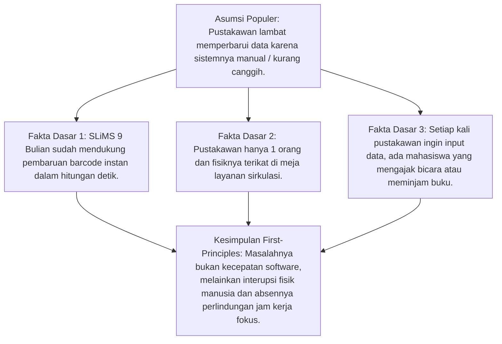
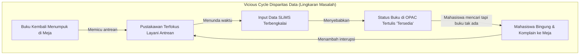

# Systemic-Reasoning & Deep Logic Skill

Skill ini berfungsi sebagai **mesin penalaran mendalam (*deep reasoning engine*)** bagi AI Agent untuk membedah dinamika sistem informasi organisasi secara logis, menghubungkan relasi sebab-akibat lintas tingkat manajemen, dan menguji ketahanan solusi melalui sintesis dialektis.

---

## 🔬 1. PENALARAN DARI HUKUM DASAR (FIRST-PRINCIPLES THINKING)

Jangan menerima asumsi umum begitu saja. Bongkar masalah organisasi perpustakaan ke fakta paling mendasar:

---

## 🔄 2. DIAGRAM IKATAN SEBAB-AKIBAT (CAUSAL LOOP DIAGRAM)

Pahami dinamika melingkar (*reinforcing & balancing loops*) di Perpustakaan FT UNY:

### Intervensi Sistemik:
- **Rak Transit** memutus panah $A1 \rightarrow B1$ (pemustaka menaruh buku sendiri secara tertib).
- **SOP Quiet Hour** memutus panah $B1 \rightarrow C1$ (waktu input data dijamin tanpa interupsi).
- Hasilnya: Siklus berbalik menjadi **lingkaran perbaikan (*virtuous cycle*)**.

---

## ⚖️ 3. SINTESIS DIALEKTIS (TESIS - ANTITESIS - SINTESIS)

Sebelum menyajikan kesimpulan atau rekomendasi di laporan, lakukan uji dialektika untuk memastikan argumen tidak rapuh:

| Komponen Dialektika | Penerapan pada Kasus Perpustakaan FT UNY |
| :--- | :--- |
| **Tesis (Ide Solusi)** | *Terapkan SOP Quiet Hour selama 1 jam setiap hari kerja agar pustakawan dapat menginput data SLiMS tanpa gangguan.* |
| **Antitesis (Sanggahan Kritis)** | *Jika layanan ditutup 1 jam setiap hari, mahasiswa yang ingin meminjam atau mengembalikan buku pada jam tersebut akan kecewa dan merasa hak layanannya dipangkas.* |
| **Sintesis (Solusi Matang Terpadu)** | *Quiet Hour hanya diberlakukan 1 kali seminggu pada hari dan jam dengan volume kunjungan terendah (Jumat pk 08.00–09.00 WIB), dengan tetap menyediakan Rak Transit Mandiri dan Signage sehingga mahasiswa tetap dapat mengembalikan buku tanpa hambatan.* |

---

## 📶 4. LOGIKA KESELARASAN 3 LEVEL (VERTICAL ALIGNMENT LOGIC)

Setiap argumen praktikum wajib dapat dirunut alurnya dari bawah ke atas:
$$\text{Operasional (Pustakawan & Pemustaka)} \longrightarrow \text{Manajerial (Kepala Perpus & Akreditasi)} \longrightarrow \text{Strategis (Dekanat FT UNY)}$$

Jika solusi di tingkat operasional diperbaiki (Quiet Hour & Rak Transit), data manajerial menjadi valid (Borang LAM-INFOKOM Kriteria 5), sehingga pimpinan strategis (Dekanat) dapat mengambil keputusan alokasi anggaran yang tepat sasaran.

---

## 🔗 Navigasi Graf
> 🔗 **Terkoneksi dengan**: [[Dashboard]] | [[problem-solving]] | [[academic-skill]] | [[enterprise-architecture]] | [[defense-prep]]
