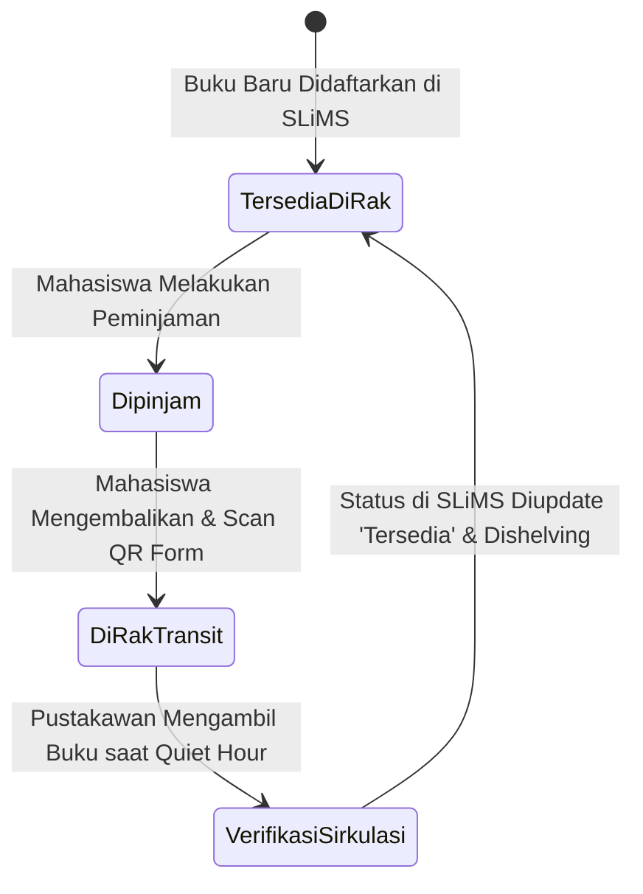
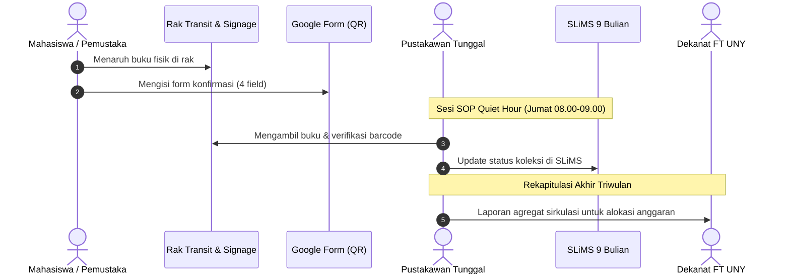
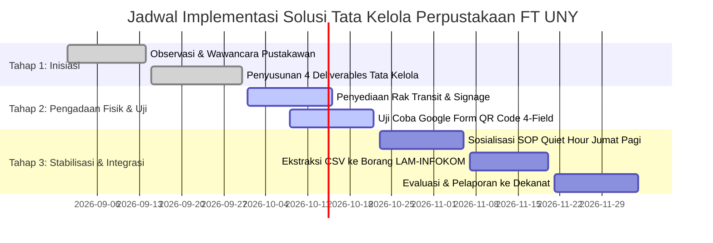

# Visualization & System Modeling Skill

Skill ini memandu AI Agent dalam merancang representasi visual berstandar tinggi (*visual information design*) menggunakan sintaks **Mermaid Diagram** dan **Visual Markdown Tables**, sehingga konsep tata kelola yang rumit dapat dicerna secara instan dan menarik oleh dosen penguji.

---

## 🎨 1. KATALOG DIAGRAM RESMI MERMAID UNTUK MSI

Gunakan jenis diagram yang tepat sesuai konteks analisis:

### 1. Alur Kerja & SOP $\rightarrow$ `flowchart TD` atau `flowchart LR`
Digunakan untuk memvisualisasikan alur pemutakhiran data, SOP Quiet Hour, dan penanganan fisik buku di rak transit.

### 2. Interaksi Antar-Aktor & Sistem $\rightarrow$ `sequenceDiagram`
Digunakan untuk menggambarkan urutan pesan/data dari pemustaka memindai QR code, pustakawan mengupdate SLiMS, hingga Dekanat menerima laporan borang.

### 3. Pemetaan Kuadran & Matriks $\rightarrow$ `quadrantChart`
Digunakan untuk analisis *Power vs Interest Stakeholders* dan matriks prioritas solusi (Dampak vs Usaha).

### 4. Siklus Hidup & Status Dokumen/Koleksi $\rightarrow$ `stateDiagram-v2`
Digunakan untuk memetakan perubahan status fisik dan digital sebuah buku di perpustakaan:

---

## 🛡️ 2. ATURAN INTEGRITAS MERMAID (ANTI-CRASH SYNTAX)

Agar diagram tidak menghasilkan kotak merah (*Syntax Error*) di Obsidian maupun parser Markdown:

1. **Bungkus Label Khusus dengan Petik Ganda**: Seluruh label yang memuat tanda kurung `()`, tanda hubung `-`, spasi, atau simbol wajib dibungkus petik ganda:  
   ✔️ `A["Rak Transit (Pengembalian)"]`  
   ❌ `A[Rak Transit (Pengembalian)]` $\rightarrow$ *Crash parser!*
2. **Gunakan ` ` untuk Baris Baru**: Dilarang menggunakan newline mentah di dalam kurung siku node.
3. **Gunakan ID Node yang Bersih**: Gunakan huruf dan angka sederhana untuk ID (`NodeA`, `Step1`, `Proc_01`).
4. **Hindari Panah Melingkar Tanpa Ujung (*Infinite Loop*)**.

---

## 📊 3. FORMAT TABEL VISUAL STANDAR (VISUAL MARKDOWN TABLES)

Gunakan sistem penanda visual emoji yang konsisten untuk mempercepat pemahaman:

| Indikator Visual | Arti / Makna Tata Kelola | Contoh Penggunaan di Naskah |
| :---: | :--- | :--- |
| ✅ | **Tercapai / Terverifikasi** | Target integrasi data SLiMS telah tervalidasi. |
| 🔄 | **Dalam Proses / Rutin** | SOP Quiet Hour berjalan setiap hari Jumat pagi. |
| ⚠️ | **Perhatian Khusus / Risiko** | Potensi antrean jika rak transit penuh sebelum jam 09.00. |
| ❌ | **Ditolak / Hambatan Kritis** | Koding aplikasi baru ditolak karena ketiadaan anggaran. |
| 🏛️ | **Tingkat Strategis (Dekanat)** | Aliran data borang pengadaan buku tahunan. |
| 👤 | **Tingkat Operasional (Pustakawan)** | Beban fisik meja sirkulasi. |

---

## 📋 4. TEMPLATE SIAP PAKAI MERMAID UNTUK PRAKTIKUM MSI

### Template A: Sequence Diagram Interaksi 5 Titik (Modul 5)

### Template B: Gantt Chart Jadwal Implementasi 1 Semester (Modul 7)

---

## 🔗 Navigasi Graf
> 🔗 **Terkoneksi dengan**: [[Dashboard]] | [[system-blueprint]] | [[enterprise-architecture]] | [[self-audit]] | [[self-healing]]

