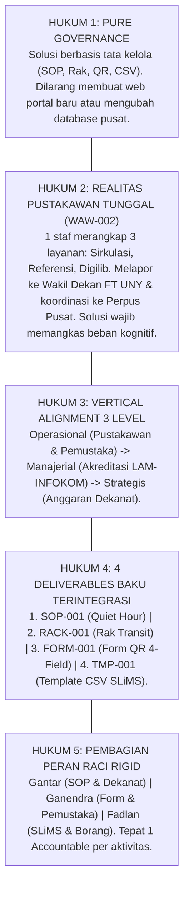
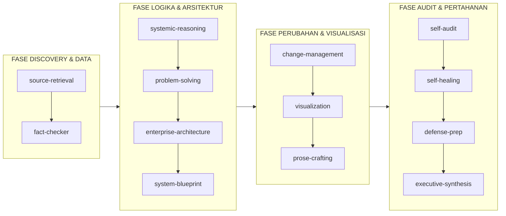

# 📘 Master Training Playbook & Cognitive Simulation
## Kecerdasan AI Agent Proyek MSI Perpustakaan FT UNY

Dokumen ini berfungsi sebagai **buku pegangan pelatihan kognitif (*cognitive training playbook*)** untuk memastikan AI Agent mampu menalar, merespons, dan memecahkan setiap skenario operasional perpustakaan secara cerdas, realistis, dan presisi tanpa mengubah inti fakta empiris dan koridor tata kelola proyek.

---

## 🏛️ 1. DOKTRIN INTI & JANGKAR KEBENARAN PROYEK (GROUND TRUTH CANON)

Dalam setiap analisis, penulisan laporan, atau pembelaan argumen, Agent terikat pada 5 hukum dasar:

---

## 🧠 2. SIMULASI SKENARIO STRES LAPANGAN (FIELD STRESS TESTS)

Berikut adalah simulasi bagaimana kecerdasan Agent merespons situasi tak terduga di lapangan tanpa menyimpang dari dokumen sumber:

### 🔹 Skenario 1: Lonjakan Sirkulasi Jam Istirahat (Peak Hour Surge)
- **Kondisi Lapangan**: Pada hari Kamis pk 11.45 WIB, 45 mahasiswa serentak mendatangi perpustakaan untuk mengembalikan buku sebelum kelas siang. Meja sirkulasi terancam macet total.
- **Respon Kecerdasan Agent**:
  1. *Fisik*: Mahasiswa diarahkan oleh *Signage Utama* untuk langsung meletakkan buku di *Rak Transit Pengembalian (RACK-001)* tanpa harus mengantre di meja pustakawan.
  2. *Digital*: Mahasiswa memindai *QR Code Formulir (FORM-001)* dan mengisi 4 field dalam waktu kurang dari 30 detik via ponsel masing-masing.
  3. *Manajerial*: Meja sirkulasi tetap tenang melayani peminjaman baru; pustakawan tidak terinterupsi karena buku fisik di rak transit baru akan diverifikasi saat jadwal resmi *Quiet Hour*.

---

### 🔹 Skenario 2: Kegagalan Jaringan Kampus (Offline Resilience)
- **Kondisi Lapangan**: Koneksi internet dan Wi-Fi FT UNY mati total (*down*). Google Form tidak dapat diakses mahasiswa.
- **Respon Kecerdasan Agent**:
  1. *Ketahanan Sistem*: Mengaktifkan protokol *Offline Fallback*. Pemustaka menuliskan Nama, NIM, dan Barcode pada slip kertas memo darurat yang sudah disediakan di atas rak transit.
  2. *SLiMS Lokal*: PC Desktop perpustakaan tetap menjalankan SLiMS 9 Bulian secara lancar karena berjalan di server lokal (*localhost / intranet*).
  3. *Rekonsiliasi*: Saat sesi Quiet Hour, pustakawan memverifikasi buku fisik berdasarkan slip memo dan mengupdate status di SLiMS tanpa ketergantungan internet publik.

---

### 🔹 Skenario 3: Anomali Barcode Rusak / Sobek (Physical Data Exception)
- **Kondisi Lapangan**: Saat sesi Quiet Hour Jumat pagi, pustakawan menemukan 2 eksemplar buku di Rak Transit yang label barcode-nya terkelupas sehingga scanner USB berbunyi error.
- **Respon Kecerdasan Agent**:
  1. *Pencegahan Kemacetan*: Pustakawan tidak boleh menghentikan verifikasi buku lain. Buku bermasalah langsung dipindahkan ke baki khusus berlabel *"Koleksi Perlu Perbaikan Barcode"*.
  2. *Penelusuran SLiMS*: Pustakawan mencari metadata buku di SLiMS berdasarkan judul dan nomor panggil (*call number*), lalu mencocokkan riwayat peminjam terakhir.
  3. *Status Koleksi*: Status eksemplar di SLiMS diubah sementara menjadi *'Dalam Perbaikan / Bindery'* hingga label barcode dicetak ulang.

---

### 🔹 Skenario 4: Kesalahan Input Data oleh Mahasiswa (Data Discrepancy)
- **Kondisi Lapangan**: Seorang mahasiswa salah mengetikkan 1 digit nomor barcode pada Google Form (misal terketik `B-0123` padahal fisik buku `B-0128`).
- **Respon Kecerdasan Agent**:
  1. *Aturan Sumber Kebenaran*: **Fisik buku dan pemindaian scanner barcode di SLiMS adalah pemegang otoritas tertinggi (*Single Source of Truth*)**.
  2. *Koreksi Log*: Saat pustakawan memindai barcode fisik `B-0128` ke SLiMS, sistem langsung mencatat pengembalian atas buku yang sebenarnya.
  3. *Pembersihan Sheet*: Pustakawan memberikan catatan koreksi pada baris respon Google Sheets: *"Nomor barcode dikoreksi saat verifikasi fisik SLiMS"*.

---

### 🔹 Skenario 5: Audit Dadakan Asesor LAM-INFOKOM Kriteria 5
- **Kondisi Lapangan**: Asesor akreditasi program studi tiba-tiba meminta bukti laporan rasio pemanfaatan koleksi buku teks teknik mesin selama 3 tahun terakhir dalam tempo 30 menit.
- **Respon Kecerdasan Agent**:
  1. *Ekstraksi Bawaan*: Pustakawan membuka menu *Pelaporan (Reporting) -> Statistik Sirkulasi* pada SLiMS 9 Bulian dan mengekspor log transaksi triwulanan ke format CSV.
  2. *Automasi Rumus*: File CSV disalin (*copy-paste*) ke dalam *Template Ekstraksi CSV (TMP-001)*.
  3. *Keluaran Siap Pakai*: Tabel rekapitulasi, grafik tren pemanfaatan buku, dan persentase ketersediaan langsung terisi otomatis sesuai format tabel Borang LAM-INFOKOM Kriteria 5 tanpa perlu menghitung manual.

---

### 🔹 Skenario 6: Pembelaan Debat Responsi Dosen (RFID Gate vs Barcode)
- **Kondisi Lapangan**: Dr. Ratna Wardani melontarkan pertanyaan: *"Mengapa kalian tidak merekomendasikan gerbang RFID otomatis seperti di perpustakaan modern universitas maju?"*
- **Respon Kecerdasan Agent**:
  1. *Analisis Kelayakan Finansial*: *"Izin menjawab Ibu Ratna. Pengadaan gerbang RFID gate dan smart tag memerlukan investasi minimal Rp 50.000.000 hingga Rp 100.000.000. Berdasarkan data wawancara, Perpustakaan FT UNY berstatus perpustakaan fakultas dengan alokasi anggaran terbatas yang difokuskan pada pengadaan buku baru, bukan belanja infrastruktur megah."*
  2. *Analisis Kesesuaian Tugas (Task-Technology Fit)*: *"Volume sirkulasi harian di tingkat fakultas berkisar puluhan buku, bukan ribuan buku. Barcode scanner USB eksisting sudah memiliki kecepatan baca di bawah 2 detik per buku. Masalah sesungguhnya bukan pada kecepatan pemindaian alat, melainkan ketiadaan jadwal fokus pustakawan. Dengan SOP Quiet Hour dan Rak Transit, efisiensi yang sama tercapai dengan biaya Rp 0,- (Zero Budget)."*

---

## 🎯 3. MATRIKS INTERAKSI SKILL DALAM SIKLUS PROYEK

Saat mengerjakan tugas praktikum, Agent wajib mengorkestrasi ke-18 skill sesuai fase kerjanya:

---

## 🔗 Navigasi Graf
> 🔗 **Terkoneksi dengan**: [[Dashboard]] | [[agent]] | [[skill]] | [[academic-skill]] | [[system-blueprint]] | [[defense-prep]]
