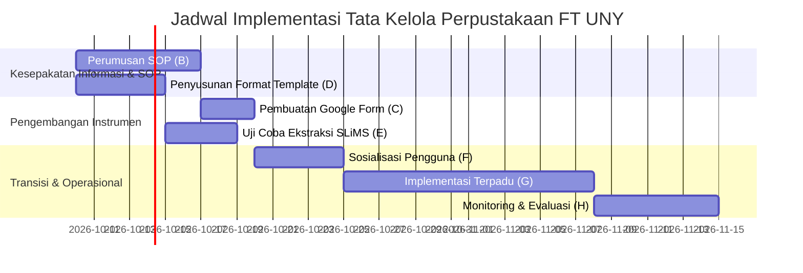
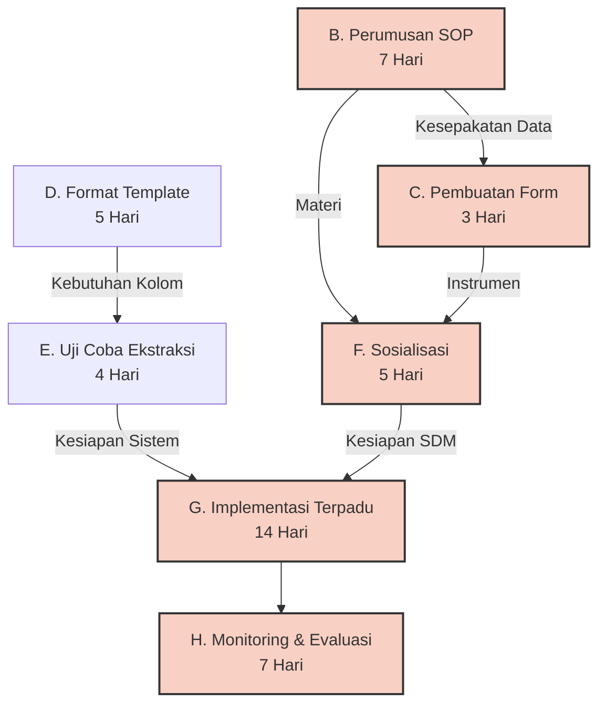

**LAPORAN PRAKTIKUM MINGGUAN**

*Manajemen Sistem Informasi (PTF60234)  Pertemuan 7* 

Pembuatan Gantt Chart dan PERT Chart 

**Disusun Oleh :**
**Kelompok 3** 

**PROGRAM PENDIDIKAN TEKNIK INFORMATIKA**  
**FAKULTAS TEKNIK**  
**UNIVERSITAS NEGERI YOGYAKARTA**  
**2026**

---

### 1. Identitas Laporan

| Nama Kelompok | Kelompok 3 |
| :---- | :---- |
| **Anggota (NIM/Nama)** | 1. Gantar Abimanyu (24050530042) 2. Ganendra Pradipa (24050530038) 3. M Fadlan Dirmansyah (24050530034) |
| **Pertemuan ke-** | 7 |
| **Tanggal Pelaksanaan** | 09 Oktober 2026 |
| **Organisasi/Kasus yang Digunakan** | Perpustakaan Fakultas Teknik, Universitas Negeri Yogyakarta (FT UNY) |

---

### 2. TUJUAN KEGIATAN  
Praktikum pada pertemuan ketujuh bertujuan untuk menyusun penjadwalan proyek berdasarkan [[Ekosistem Informasi Perpustakaan.md|solusi tata kelola (Pure Governance)]] yang telah dirancang pada [[Praktikum_6_Kelompok3.md|Pertemuan 6]]. Penjadwalan ini secara khusus menyoroti **ketergantungan informasi**, di mana suatu aktivitas tidak dapat dieksekusi sebelum keputusan mengenai format atau kesepakatan data dari aktivitas sebelumnya selesai dilakukan.
Secara khusus, kegiatan ini bertujuan untuk:
1. Menyusun **Gantt Chart** implementasi tata kelola Perpustakaan FT UNY.
2. Memetakan ketergantungan antar-aktivitas ke dalam jaringan **PERT Chart**.
3. Mengidentifikasi **Jalur Kritis (Critical Path)** proyek dan menganalisis dampaknya jika terjadi keterlambatan pada penyepakatan informasi.

---

### 3. URAIAN PELAKSANAAN KEGIATAN  
Berdasarkan hasil analisis dari [[Praktikum_6_Kelompok3.md|Modul 6 (Arsitektur dan Matriks Implementasi)]] dan batasan sumber daya di [[Jawaban3_Final.md|Wawancara 3]] mengenai kondisi Pustakawan Tunggal, Kelompok 3 tidak merancang *software* baru. Implementasi lebih berfokus mengandalkan optimalisasi SLiMS yang sudah ada, melalui pendekatan [[Ekosistem Informasi Perpustakaan.md|Ekosistem Informasi]]: pendirian SOP *Quiet Hour*, Rak Transit, Google Form QR Code, dan Template LAM-INFOKOM.

Dalam menyusun penjadwalan proyek ini, kami memecah tahapan implementasi menjadi 7 aktivitas utama (B hingga H). Penjadwalan ini sangat menekankan **Aspek Tata Kelola dan Kualitas Informasi (Aspek 2)** dari MSI. Misalnya, *Pembuatan Google Form (Aktivitas C)* tidak boleh dimulai sebelum *Perumusan SOP (Aktivitas B)* disepakati. Hal ini karena *field* pertanyaan di Google Form sepenuhnya bergantung pada kebutuhan informasi yang didikte oleh SOP. Jika form dibuat mendahului SOP (ketergantungan informasi dilanggar), maka akan terjadi risiko pendataan ulang yang membuang waktu.

---

### 4. HASIL DAN ARTEFAK PRAKTIKUM  

#### A. Daftar Aktivitas dan Estimasi Durasi
Berikut adalah rincian aktivitas beserta ketergantungan informasinya:

| Kode | Aktivitas Implementasi | Durasi (Hari) | Ketergantungan (*Predecessor*) | Alasan Ketergantungan (Aspek MSI) |
| :--- | :--- | :--- | :--- | :--- |
| **B** | Perumusan SOP *Quiet Hour* & Rak Transit | 7 | - | Fondasi aturan (Aspek Tata Kelola). |
| **D** | Penyusunan Format Template LAM-INFOKOM | 5 | - | Penentuan kebutuhan informasi pelaporan Dekanat. |
| **C** | Pembuatan Google Form & QR Code | 3 | B | Form harus mengikuti standar atribut pelaporan dari SOP. |
| **E** | Uji Coba Ekstraksi SLiMS ke Template | 4 | D | Ekstraksi *database* SLiMS harus memetakan ke format template D yang disepakati. |
| **F** | Sosialisasi Pustakawan & Pemustaka | 5 | C, B | Harus menunggu SOP sah dan Form siap sebelum melatih pengguna. |
| **G** | Implementasi Terpadu (*Go-Live*) | 14 | E, F | *Go-Live* operasional hanya bisa berjalan setelah SDM dan instrumen pelaporan siap. |
| **H** | Monitoring & Evaluasi Workflow | 7 | G | Penilaian nilai informasi (ROI) baru bisa berjalan pasca-*Go Live*. |

#### B. Gantt Chart Proyek MSI
Di bawah ini adalah representasi visual penjadwalan proyek menggunakan Gantt Chart.

#### C. PERT Chart dan Analisis Jalur Kritis (*Critical Path*)
PERT Chart memetakan hubungan ketergantungan prasyarat dari setiap langkah.

**Analisis Jalur (*Path Analysis*):**
1. **Jalur 1 (Tata Kelola Operasional):** B (7) $\rightarrow$ C (3) $\rightarrow$ F (5) $\rightarrow$ G (14) $\rightarrow$ H (7) = **36 Hari**
2. **Jalur 2 (Tata Kelola Manajerial):** D (5) $\rightarrow$ E (4) $\rightarrow$ G (14) $\rightarrow$ H (7) = **30 Hari**

**Kesimpulan Jalur Kritis:**
Jalur terpanjang yang memakan waktu 36 hari (Jalur 1) merupakan **Jalur Kritis (*Critical Path*)**. Ini membuktikan bahwa dalam studi kasus Perpustakaan FT UNY, hambatan terbesar bukanlah pada ranah teknis (ekstraksi data SLiMS yang hanya butuh 9 hari total di Jalur 2), melainkan pada **kesepakatan informasi dan perilaku organisasi (SOP dan Sosialisasi)**. 
Jika *Perumusan SOP* terlambat disepakati oleh Pustakawan Utama, maka keseluruhan peluncuran tata kelola akan langsung tertunda, menjadikan Aspek Adopsi Perilaku (Aspek 7 MSI) sebagai determinan kesuksesan yang utama.

---

### 5. KENDALA DAN SOLUSI  
**Kendala:**  
Selama penyusunan jadwal implementasi, kami sempat kesulitan dalam menentukan batas durasi yang realistis untuk sosialisasi SOP kepada pemustaka, mengingat jumlah kunjungan mahasiswa yang fluktuatif di perpustakaan FT UNY. Selain itu, sinkronisasi waktu luang antara Pustakawan Tunggal dan Tim Akreditasi LAM-INFOKOM dalam merumuskan *Template* berpotensi molor dari estimasi 5 hari.  
**Solusi:**  
Kami memberikan kelonggaran waktu (*buffer time*) pada Jalur Kritis dengan mematok durasi 14 hari untuk Implementasi Terpadu (*Go-Live*), sehingga proses adaptasi dan sosialisasi informal dapat terus berjalan beriringan dengan pelayanan harian perpustakaan tanpa mengganggu pelayanan.

---

### 6. REFLEKSI PEMBELAJARAN  
Pembelajaran utama dari praktikum penyusunan penjadwalan ini adalah pemahaman mendalam tentang **Ketergantungan Informasi**. Kami menyadari bahwa dalam Manajemen Sistem Informasi, kelancaran proyek tidak selalu ditentukan oleh cepatnya sistem aplikasi dibuat, tetapi lebih kepada kejelasan wewenang (RACI) dan standar format data (SOP). Keterlambatan dalam mengambil keputusan organisasi dapat menjadi penghalang (*bottleneck*) terbesar yang menggeser *Critical Path* proyek. Hal ini mengonfirmasi prinsip **Adopsi dan Perilaku Organisasi (Aspek 7 MSI)** bahwa membangun komitmen Pustakawan dan Pemustaka jauh lebih kritis ketimbang sekadar meluncurkan Google Form.

---

### 7. KESIMPULAN  
Praktikum Modul 7 berhasil memetakan penjadwalan solusi tata kelola Perpustakaan FT UNY. Melalui analisis **PERT Chart**, ditemukan bahwa **Jalur Kritis** memakan waktu **36 Hari**, yang didominasi oleh lintasan operasional (SOP, Sosialisasi, dan Implementasi). Penjadwalan ini membuktikan bahwa keberhasilan penyelesaian masalah keterlambatan sinkronisasi data SLiMS sangat bergantung pada fase kesepakatan sosial dan kejelasan tata kelola, bukan semata pada penambahan infrastruktur teknis komputasi.

**Referensi:**
- Wardani, R. (2026). *[[Modul 7|Modul 7 Praktikum Manajemen Sistem Informasi]]*. Universitas Negeri Yogyakarta.
- Markus, M. L. (1983). *Power, politics, and MIS implementation*.
