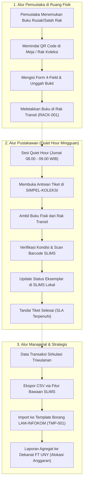
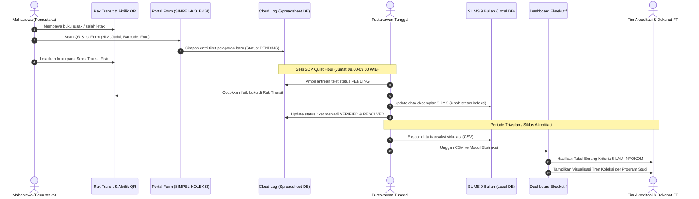
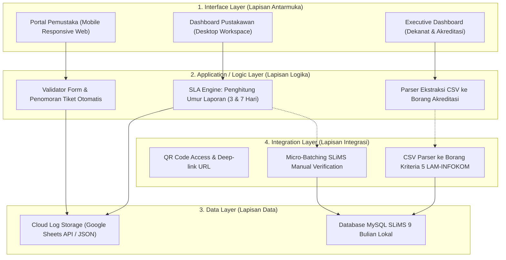
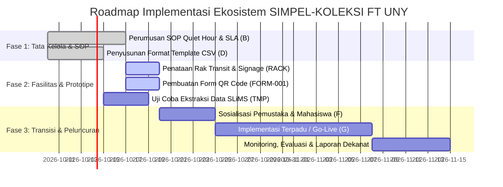

# CETAK BIRU SISTEM (SYSTEM BLUEPRINT)
## Ekosistem Tata Kelola & Sistem Pendukung Pelaporan Koleksi Terpadu (SIMPEL-KOLEKSI FT)
### Perpustakaan Fakultas Teknik Universitas Negeri Yogyakarta

> 🔗 **Navigasi Vault:** Kembali ke [[Dashboard]] | Terhubung dengan: [[Praktikum_4_Kelompok3_revisi]] | [[Praktikum_5_Kelompok3]] | [[Praktikum_6_Kelompok3]] | [[Praktikum_7_Kelompok3]]

---

## 1. IDENTITAS DOKUMEN & METADATA BLUEPRINT

| Atribut Dokumen | Keterangan Rinci |
| :--- | :--- |
| **Kode Dokumen** | `BP-MSI-001` |
| **Nama Proyek** | Cetak Biru Ekosistem Tata Kelola & Sistem Pendukung Pelaporan Koleksi Terpadu (*SIMPEL-KOLEKSI FT*) |
| **Organisasi Objek** | Perpustakaan Fakultas Teknik, Universitas Negeri Yogyakarta (FT UNY) |
| **Penyusun** | **Kelompok 3 - Praktikum Manajemen Sistem Informasi:**<br>1. Gantar Abimanyu (24050530042)<br>2. Ganendra Pradipa (24050530038)<br>3. M. Fadlan Dirmansyah (24050530034) |
| **Dosen Pengampu** | Ratna Wardani, S.Si., M.T. |
| **Klasifikasi Solusi** | *Pure Governance with Supporting Digital Instrument (Zero-Budget Ecosystem)* |
| **Status Dokumen** | **Disetujui untuk Implementasi Desain & Prototyping Mockup** |

---

## 2. LANDASAN FILOSOFIS & RASIONALISASI SISTEMIK

### 2.1. Refleksi Masalah Lapangan vs Doktrin Bu Ratna
Berdasarkan hasil investigasi empiris pada [[Jawaban3_Final|Wawancara Lapangan]], Perpustakaan FT UNY dikelola oleh **1 (satu) orang Pustakawan Tunggal** yang melayani rata-rata **52 pengunjung per hari** pada 3 fungsi layanan sekaligus (sirkulasi, referensi, dan digital library). Kondisi ini memicu keterlambatan pemutakhiran data koleksi di katalog otomasi SLiMS (*lagging data*).

Sebagaimana ditekankan oleh dosen pengampu Bu Ratna dalam [[catatan_3]] dan [[catatan_4]]:
> *"Solusinya bukan solusi teknis semata, tapi solusi yang sifatnya sistemik. Bukan berarti harus dibuatkan database baru, bukan berarti harus koding web portal baru yang menggantikan sistem pusat. Jika SOP-nya tidak jelas, aplikasi secanggih apa pun tidak akan menyelesaikan masalah. Tata kelola sistem informasi adalah mengelola organisasinya: siapa yang melapor, siapa yang memverifikasi, alur informasinya mengalir ke mana, dan bagaimana pimpinan mengambil keputusan."*

### 2.2. Prinsip Perancangan (Core Tenets)
1. **SLiMS sebagai *Single Source of Truth*:** Sistem pendukung tidak menduplikasi basis data katalog buku induk. SLiMS bawaan tetap menjadi pemegang otoritas data sirkulasi dan inventarisasi perpustakaan.
2. **Zero-Budget & Zero-Code Core Modification:** Solusi tidak menuntut pengadaan server mahal, tidak mengubah source code PHP SLiMS pusat (yang merupakan kewenangan Perpustakaan Pusat Rektorat), serta tidak menambah SDM pegawai baru.
3. **Penyelarasan Tiga Tingkat Organisasi (*Vertical Alignment*):** Menghubungkan secara harmonis tingkat **Operasional** (Pemustaka & Pustakawan), **Manajerial** (Tim Akreditasi Program Studi), dan **Strategis** (Dekan & Wakil Dekan FT UNY).

---

## 3. DIMENSI 1: KONSEP OPERASIONAL LAYANAN (CONOPS)

Konsep operasional dirancang untuk membagi beban kerja pustakawan tunggal melalui pemberdayaan partisipasi pemustaka (*user-generated reporting*) dan pemisahan waktu kerja terfokus.



### Aturan Operasional & Batas Waktu Layanan (SLA):
* **SLA-1 (Verifikasi Fisik Laporan):** Maksimal **3 hari kerja** sejak laporan diserahkan melalui formulir QR Code.
* **SLA-2 (Pembaruan Status SLiMS):** Maksimal **7 hari kerja** sejak laporan diserahkan, seluruh status eksemplar di SLiMS telah diperbarui ke status *Rusak*, *Dalam Perbaikan*, atau *Hilang*.
* **Jadwal SOP Quiet Hour:** Ditetapkan setiap **Jumat pagi pukul 08.00 s.d. 09.00 WIB** sebagai slot hening tanpa gangguan antrean peminjaman tatap muka.

---

## 4. DIMENSI 2: ARSITEKTUR ALIRAN INFORMASI (DATA FLOW & INTEROPERABILITY)

Interoperabilitas data dirancang menggunakan prinsip *Zero-Code Loose Coupling*, memanfaatkan format pertukaran data ringan (Cloud Log dan CSV Export).



### Kamus Data Sederhana (Data Dictionary)

#### A. Entitas Tiket Pelaporan Pemustaka (`TBL_LAPORAN_MANDIRI`)
| Nama Field | Tipe Data | Deskripsi | Sumber Input |
| :--- | :--- | :--- | :--- |
| `ticket_id` | String (Auto) | Nomor tiket pelaporan unik (contoh: `TKT-202610-001`) | Sistem |
| `reporter_nim` | String (11) | Nomor Induk Mahasiswa pelapor | Pemustaka |
| `reporter_name` | String (100) | Nama lengkap mahasiswa | Pemustaka |
| `item_barcode` | String (20) | Barcode eksemplar buku pada label SLiMS | Pemustaka (Scan/Ketik) |
| `item_title` | String (255) | Judul buku yang dilaporkan | Pemustaka |
| `issue_category`| Enum | Pilihan: `Halaman Sobek`, `Halaman Hilang`, `Salah Rak`, `Hilang Fisik` | Pemustaka |
| `evidence_url` | String (URL) | Link foto kondisi fisik buku (Cloud Storage) | Pemustaka (Unggah) |
| `timestamp` | Datetime | Waktu pengiriman laporan | Sistem |
| `verification_status` | Enum | Pilihan: `PENDING`, `IN_REVIEW`, `VERIFIED`, `RESOLVED` | Pustakawan |
| `slims_updated` | Boolean | Indikator status apakah SLiMS sudah di-update | Pustakawan |
| `sla_indicator` | Enum | Pilihan: `GREEN` (<3 hari), `YELLOW` (3-5 hari), `RED` (>7 hari) | Logika Sistem |

---

## 5. DIMENSI 3: ARSITEKTUR SISTEM INFORMASI BERLAPIS (4-LAYER MODEL)

Sebagaimana dirumuskan dalam [[Praktikum_6_Kelompok3]], arsitektur pendukung disusun ke dalam 4 lapisan terintegrasi:



---

## 6. DIMENSI 4: BLUEPRINT TATA RUANG FASILITAS FISIK (SPATIAL BLUEPRINT)

Tata ruang fisik dirancang untuk mengurai tumpukan buku pada meja sirkulasi utama dan memandu pergerakan pemustaka secara mandiri (*self-service circulation*).

```
┌────────────────────────────────────────────────────────────────────────┐
│                   DENAH RUANG PERPUSTAKAAN FT UNY                       │
├────────────────────────────────────────────────────────────────────────┤
│  [ PINTU MASUK / KELUAR ]                                              │
│         │                                                              │
│         ├───► [ STAND AKRILIK SIGNAGE & QR CODE SCANNER ]              │
│         │     "Petunjuk Alur Pengembalian & Laporan Koleksi Rusak"     │
│         │                                                              │
│         ├───► [ RAK TRANSIT PENGEMBALIAN (RACK-001) ]                  │
│         │     ┌──────────────────────────────────────────────────┐     │
│         │     │ Tingkat 1: Buku Kembali Normal (Siap Shelving)   │     │
│         │     ├──────────────────────────────────────────────────┤     │
│         │     │ Tingkat 2: Buku Laporan Rusak / Hilang (QR Form) │     │
│         │     └──────────────────────────────────────────────────┘     │
│         │                                                              │
│         └───► [ MEJA COUNTER SIRKULASI PUSTAKAWAN ]                    │
│               ├── PC All-in-One (SLiMS 9 Bulian & Dashboard SIMPEL)    │
│               ├── Barcode Scanner USB                                  │
│               └── Area Pelayanan Bebas Tumpukan (Pelayanan Prima)      │
│                                                                        │
│  [ AREA RAK KOLEKSI BUKU UTAMA ]           [ AREA MEJA BACA MAHASISWA] │
└────────────────────────────────────────────────────────────────────────┘
```

---

## 7. DIMENSI 5: SPESIFIKASI ANTARMUKA MOCKUP SISTEM (UI/UX SPECIFICATION)

Mockup sistem **SIMPEL-KOLEKSI FT** dirancang dalam 3 antarmuka terpisah sesuai peran pemangku kepentingan:

### 7.1. Antarmuka 1: Portal Pemustaka (*Mobile Responsive Form*)
* **Pengguna Utama:** Mahasiswa Fakultas Teknik UNY (Pemustaka).
* **Aksesibilitas:** Dipicu via pemindaian stiker QR Code di meja baca atau Rak Transit.
* **Elemen Antarmuka:**
  1. **Header:** Identitas resmi *"Perpustakaan FT UNY - Layanan Laporan Mandiri Koleksi"*.
  2. **Field 1 (Identitas Mahasiswa):** Input NIM dan Nama Lengkap (Otomatis / Input Cepat).
  3. **Field 2 (Data Buku):** Input Barcode Buku (didukung tombol *Scan Barcode Kamera*) dan Judul Buku.
  4. **Field 3 (Jenis Kerusakan / Masalah):** Radio card interaktif:
     - 📕 Halaman Robek / Rusak Fisik
     - 📑 Halaman Hilang Sebagian
     - 🔍 Buku Salah Letak / Tidak Sesuai OPAC
     - ❓ Koleksi Hilang Fisik
  5. **Field 4 (Bukti Foto):** Tombol *Ambil Foto Kamera / Unggah Gambar*.
  6. **Catatan Tambahan:** Textarea keterangan opsional (misal: "Halaman 45-50 hilang").
  7. **Tombol Submit:** *"Kirim Laporan & Letakkan Buku di Rak Transit"*.
  8. **Layar Sukses (Modal):** Menampilkan Nomor Tiket (`TKT-XXXX`), estimasi SLA penyelesaian 3 hari, dan instruksi peletakan buku di Rak Transit.

---

### 7.2. Antarmuka 2: Dashboard Pustakawan Tunggal (*Quiet Hour Workspace*)
* **Pengguna Utama:** Pustakawan Tunggal Perpustakaan FT UNY.
* **Perangkat Target:** Desktop PC Counter Layanan / Tablet Kerja.
* **Elemen Antarmuka:**
  1. **Top Bar Header:**
     - Jam digital operasional real-time.
     - **Tombol Pengaktif "Quiet Hour Mode":** Mengaktifkan timer fokus 60 menit dan mengubah status loket menjadi "Sesi Pemutakhiran Data".
     - Profil akun Pustakawan.
  2. **Statistik Kartu Cepat (KPI Metrics):**
     - 📥 Total Laporan Masuk Minggu Ini.
     - ⏳ Menunggu Verifikasi Fisik (Pending).
     - ⚠️ Mendekati Batas SLA (> 3 Hari).
     - ✅ Sukses Ter-update ke SLiMS.
  3. **Tabel Antrean Tiket (Verifikasi Interaktif):**
     - Kolom: `No Tiket`, `Tanggal`, `Barcode`, `Judul Koleksi`, `Kategori Isu`, `Status SLA (Badge Hijau/Kuning/Merah)`, `Aksi`.
  4. **Panel Aksi Cepat (Modal Verifikasi Tiket):**
     - Pratinjau foto bukti kerusakan dari mahasiswa.
     - Checklist 1: `[ ] Fisik buku diambil dari Rak Transit dan diperiksa`.
     - Checklist 2: `[ ] Status eksemplar di SLiMS diubah menjadi (RUSAK/PERBAIKAN)`.
     - Tombol: `Selesaikan Tiket (Resolve)` & `Tolak / Perlu Konfirmasi`.

---

### 7.3. Antarmuka 3: Dashboard Eksekutif & Akreditasi (*Executive & Accreditation View*)
* **Pengguna Utama:** Tim Akreditasi Program Studi & Dekanat FT UNY (Dekan / Wakil Dekan).
* **Perangkat Target:** Web Browser Desktop Pimpinan.
* **Elemen Antarmuka:**
  1. **Modul Ekstraksi Borang LAM-INFOKOM (1-Click Generator):**
     - Tombol unggah/tarik file CSV transaksi sirkulasi SLiMS.
     - Pratinjau otomatis tabel standar akreditasi Kriteria 5 (Tabel Pustaka: Jumlah Judul, Jumlah Eksemplar, Frekuensi Peminjaman per Program Studi).
     - Tombol: *"Download Format Borang Excel (Siap Submit Akreditasi)"*.
  2. **Grafik Visualisasi Tren Sirkulasi & Kerusakan:**
     - Grafik Bar Interaktif: Peminjaman Terbanyak per Program Studi (PTE, PTI, Mesin, Sipil, Elektronika).
     - Donut Chart: Rasio Koleksi Prima vs Koleksi Rusak/Sedang Diperbaiki.
  3. **Panel Rekomendasi Alokasi Anggaran Pengadaan Buku (*Evidence-Based Procurement*):**
     - Ringkasan rekomendasi belanja berbasis data riil:
       > *"Berdasarkan rasio keterpakaian 94% pada Program Studi PTI dan tingginya laporan kerusakan buku kecerdasan buatan, direkomendasikan alokasi 35% anggaran pengadaan buku tahun depan diprioritaskan pada pembaruan buku referensi informatika."*
     - Tombol cetak: *"Unduh Ringkasan Eksekutif untuk Rapat Anggaran Fakultas"*.

---

## 8. ROADMAP IMPLEMENTASI & ALINYEMEN MANAJEMEN

Berdasarkan analisis WBS dan Jalur Kritis (Modul 7), implementasi blueprint ini memakan waktu **36 Hari Kerja**:



---

## 9. RINGKASAN PENUTUP & KELAYAKAN TATA KELOLA

Cetak Biru **SIMPEL-KOLEKSI FT** (`BP-MSI-001`) membuktikan bahwa perbaikan pengelolaan sistem informasi pada Perpustakaan Fakultas Teknik UNY tidak menuntut perombakan perangkat lunak yang rumit atau anggaran pengadaan server yang mahal. Dengan menyinergikan **SOP Quiet Hour**, **Rak Transit Fisik**, **Form Pelaporan QR Code Mandiri**, dan **Dashboard Rekapitulasi Berbasis Data**, ekosistem ini sukses menyatukan kepentingan mahasiswa, pustakawan tunggal, tim akreditasi, hingga pengambil kebijakan fakultas.

Dokumen ini menjadi dasar mutlak dalam penyusunan prototipe antarmuka sistem interaktif pada tahap berikutnya.
