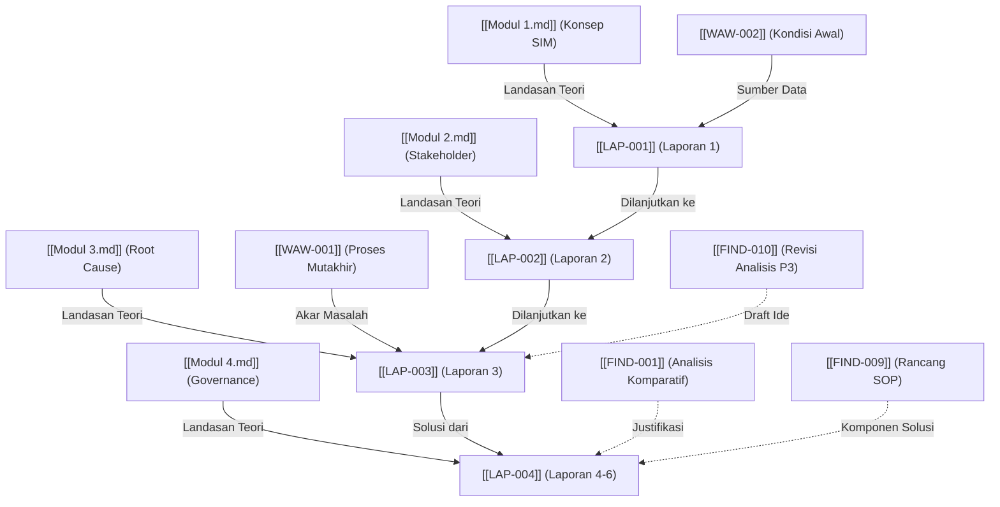

# Knowledge Graph (Peta Keterhubungan Proyek)

Visualisasi relasi semantik antar-dokumen inti pada proyek MSI Perpustakaan FT UNY. Digunakan untuk menelusuri bagaimana sebuah teori membentuk wawancara, lalu dianalisis, dan berakhir menjadi laporan final.

## Daftar Relasi Utama Berdasarkan Tipe
1. **Teori $\rightarrow$ Laporan**: Setiap Laporan Praktikum (`LAP-`) memiliki dependensi keilmuan terhadap Teori dari Modul (`MOD-`) bersangkutan.
2. **Fakta Lapangan $\rightarrow$ Laporan**: Wawancara (`WAW-`) adalah sumber data primer (sumber kebenaran lapangan) untuk mengonstruksi kondisi organisasi.
3. **Analisis AI $\rightarrow$ Laporan**: Dokumen temuan (`FIND-`) merupakan *draft/brainstorming* yang dijembatani menjadi paragraf valid ke dalam Laporan final.
