# Knowledge Graph (Peta Keterhubungan Semantik Proyek)

Visualisasi relasi semantik antar-dokumen inti pada proyek MSI Perpustakaan FT UNY. Terhubung langsung dengan [[Dashboard]], [[CONTEXT_INDEX]], [[SOURCE_INVENTORY]], dan [[THEORY_TO_EVIDENCE_MATRIX]].

```mermaid
graph TD
    %% Hub Utama
    DB["[[Dashboard]] (Jantung Proyek)"]

    %% Core Modules
    M1["[[Modul 1]] (Konsep SIM)"]
    M2["[[Modul 2]] (Stakeholder)"]
    M3["[[Modul 3]] (Root Cause)"]
    M4["[[Modul 4]] (Governance & Scope)"]
    M5["[[Modul 5]] (RACI & Kolaborasi)"]
    M6["[[Modul 6]] (Arsitektur & Change Plan)"]
    M7["[[Modul 7]] (WBS & Penjadwalan)"]

    %% Reports
    L1["[[Laporan_Praktikum_Pertemuan_1_Kelompok 3]]"]
    L2["[[Praktikum_2_Kelompok_3_revisi]]"]
    L3["[[Praktikum_3_Kelompok_3_Revisi]]"]
    L4["[[Praktikum_4_Kelompok3_revisi]]"]
    L5["[[Praktikum_5_Kelompok3]]"]
    L6["[[Praktikum_6_Kelompok3]]"]
    L7["[[Praktikum_7_Kelompok3]]"]

    %% Field Data
    W1["[[Jawaban_Wawancara (2)]]"]
    W2["[[Jawaban3_Final]]"]

    %% Catatan Kelas
    C1["[[catatan_1]]"]
    C2["[[catatan_2]]"]
    C3["[[catatan_3]]"]
    C4["[[catatan_4]]"]

    %% Referensi & Playbook
    REF1["[[Data_Perpustakaan_FT_UNY]]"]
    REF2["[[Glosarium_Perpustakaan]]"]
    AGN["[[TRAINING_PLAYBOOK]]"]

    %% Literatur Ilmiah Eksternal
    J1["Anton Risparyanto 2014<br/>(SK Menpan 132/2002)"]
    J2["Dwiatri Kusumaningrum 2016<br/>(Lingkungan Kerja & Kepuasan)"]
    J3["Rina Kusharyanti 2023<br/>(Kepemimpinan & Kinerja)"]
    J4["Rahman Effendi 2013<br/>(Kontinjensi & ISO 9001)"]

    %% Findings
    F1["[[Ekosistem Informasi Perpustakaan FT]]"]
    F9["[[Rancang SOP Sistem Informasi]]"]
    F6["[[Integrasi Portal Perpustakaan FT]]"]

    %% Relasi Dashboard
    DB --> L1 & L2 & L3 & L4 & L5 & L6 & L7
    DB --> M1 & M2 & M3 & M4 & M5 & M6 & M7
    DB --> REF1 & REF2 & AGN

    %% Relationships Teori ke Laporan
    M1 --> L1
    M2 --> L2
    M3 --> L3
    M4 --> L4
    M5 --> L5
    M6 --> L6
    M7 --> L7

    %% Relationships Alur Laporan Kumulatif
    L1 --> L2 --> L3 --> L4 --> L5 --> L6 --> L7

    %% Data Lapangan & Catatan ke Laporan
    W1 --> L1 & L2
    W2 --> L3 & L4 & L5 & L6 & L7
    C1 --> L1
    C2 --> L2
    C3 --> L3
    C4 --> L4 & L5 & L6 & L7

    %% Literatur Ilmiah ke Tata Kelola
    J1 -.-> L4 & L5
    J2 -.-> L4 & L6
    J3 -.-> L5 & L6
    J4 -.-> L4 & L7

    %% Solusi ke Laporan
    F1 -.-> L4 & L6
    F9 -.-> L4 & L5
    F6 -.-> L6
```

---

## 📌 Rantai Silsilah Artefak (Kumulatif Proyek)
1. **Modul 1 $\rightarrow$ Laporan 1**: Inisialisasi Organisasi Perpustakaan FT UNY dan identifikasi peran fungsional Pustakawan Tunggal.
2. **Modul 2 $\rightarrow$ Laporan 2**: Pemetaan Power-Interest Grid (Pemustaka, Pustakawan, Dekanat, Tim Akreditasi).
3. **Modul 3 $\rightarrow$ Laporan 3**: Analisis Akar Masalah (5 Why & Fishbone Diagram) yang membuktikan *delay* disebabkan ketiadaan SOP/jadwal rutin, bukan ketiadaan aplikasi.
4. **Modul 4 $\rightarrow$ Laporan 4**: Penetapan Scope *Pure Governance* dan 4 Deliverable (SOP Quiet Hour, Rak Transit, Form QR, Template Ekstraksi).
5. **Modul 5 $\rightarrow$ Laporan 5**: Grand Design Alur Data (3 Level Manajemen) dan RACI Matrix pembagian peran tim.
6. **Modul 6 $\rightarrow$ Laporan 6**: Arsitektur Berlapis, Evaluasi Strategi Hybrid, dan Manajemen Perubahan Perilaku.
7. **Modul 7 $\rightarrow$ Laporan 7**: WBS bertingkat, PERT Chart (Critical Path 36 Hari), dan Gantt Chart operasional.

